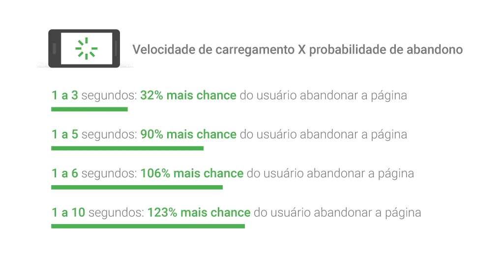
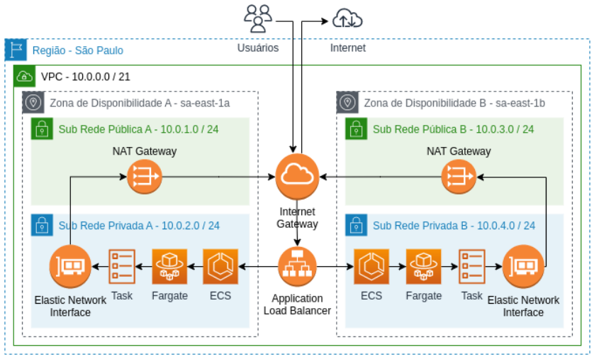
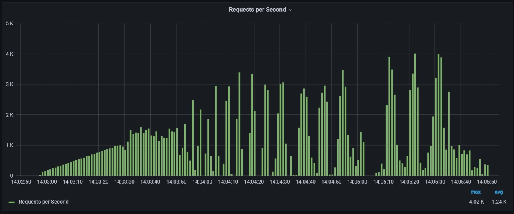
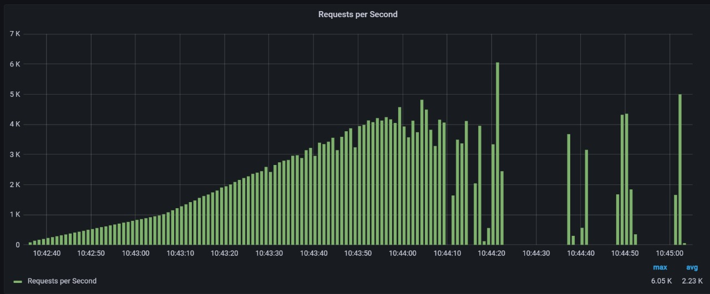

# Dimensionamento Automático na AWS para Demandas Massivas de Aplicações Web

Elias Biondo, Gabriel Carneiro, Jonas Sales, Mateus Almeida, Pedro Romão, Sarah Ribeiro e Sergio Lucas

**Resumo** - Aplicações web frequentemente enfrentam variações na demanda, particularmente durante iniciativas comerciais como campanhas de marketing ou promoções. Em um cenário ideal, onde uma campanha é extremamente bem-sucedida, o site pode ser vítima de seu próprio sucesso, incapaz de atender a todos os usuários devido a alta quantia de requisições, resultando em atrasos na resposta ou até falhas de sistema. Portanto, é crucial contar com uma infraestrutura capaz de adaptar-se a altas demandas e retornar ao seu estado padrão em momentos de demanda regular. Este artigo discute como a Amazon Web Services (AWS) atende a essa exigência, utilizando recursos como Amazon Elastic Compute Cloud (EC2), Amazon Elastic Load Balancing (ELB), Amazon Relational Database Service (RDS), Amazon Simple Storage Service (S3), Amazon Route 53 e Amazon CloudFront. Para validar nosso estudo, conduzimos testes em clusters Kubernetes com a utilização de contêineres Docker, visando suportar até 35 mil requisições por segundo. Utilizamos o k6 para executar esses testes e analisamos os resultados no Grafana.

**Palavras-chave** - AWS, Cloud, Kubernetes, Docker, Grafana.

## 1. Introdução

Em um mundo progressivamente digital, é raro encontrar empresas sem ao menos um perfil em redes sociais destacando seus produtos, pois para competir de maneira eficaz no mercado atual, a presença online tornou-se essencial. 
Diferente do passado, quando os clientes tinham que ir pessoalmente às lojas, entender quais produtos estão à oferta, conversar com atendentes, e em caso de insegurança na hora da compra, repetir todo este processo; hoje, se um produto da sua empresa não estiver disponível online, o possível cliente irá provavelmente preferir os concorrentes que estão presentes na rede. Isto é corroborado por dados que revelam que cerca de 96% das pessoas pesquisam online antes de decidir em que loja física vão comprar, e 95% pesquisam online para escolher os produtos antes de fazer uma compra em uma loja física. Ademais, 92% gastam mais tempo pesquisando sobre uma marca ou produto online do que em uma loja física e 93% checam se podem comprar algo online, evitando assim o deslocamento até uma loja física [1].

O auge da relação usuário-empresa ocorre quando o cliente pode fazer tudo através do site da empresa: criar uma conta, armazenar informações, efetuar pagamentos e receber produtos em casa, tudo isso com mínima interação e esforço. À medida que a demanda por esses sistemas aumenta, as empresas geralmente expandem sua capacidade com base na média diária de uso. No entanto, em situações atípicas, como uma campanha promocional que direciona um grande volume de tráfego para o site, pode surgir uma demanda inesperadamente alta que resulta em sobrecarga, tornando o site lento ou até mesmo inoperante.

Neste cenário, o que era um benefício torna-se um prejuízo. O site, que antes facilitava a vida do cliente, agora passa a ser sua principal fonte de frustração. As pessoas optam por sites principalmente para evitar perdas de tempo, como filas e esperas, e mesmo que o site não pare de funcionar, uma simples lentidão no carregamento pode levar o cliente a desistir da compra e buscar outras opções. Isso é evidente nos dados que mostram que 67% das pessoas afirmam que o que mais as incomoda em um site mobile é a demora para carregar o conteúdo. Além disso, 43% dos usuários, quando têm uma experiência mobile ruim, procuram o site de outra marca, e 41% dificilmente retornam ao site após uma experiência insatisfatória [1].

Comportamentos como checar online se a loja física possui o produto que querem comprar são comuns, com 87% dos consumidores praticando este hábito. E o comércio online está tão enraizado em nossos hábitos de consumo que 72% já compraram online de uma loja em que nunca estiveram pessoalmente, e 66% já fizeram uma compra online e optaram por retirar em uma loja física [1].

De acordo com a Figura 1, os dados mostram que paginas web quando acessadas em dispositivos móveis levam, em média, 22 segundos para carregar, porém 53% das pessoas abandonam o site se ele demorar mais de 3 segundos para carregar. Além disso, 50% dos usuários esperam que uma página carregue em menos de 2 segundos [2]. 



Fig. 1. Relação entre velocidade de carregamento e probabilidade de abandono. Fonte: [2]. 

Logo, é necessário não apenas que haja uma solução que consiga comportar todos esses usuários nessa alta variação de demanda, mas também que possa voltar a sua capacidade normal após o término da campanha, evitando gastos desnecessários com infraestrutura. 

Neste contexto, este trabalho se insere apresentando uma possível solução para o problema. Utilizamos implementações serverless da AWS, que incluem todos os recursos necessários para suportar uma demanda massiva de aplicações web e retornar ao seu estado padrão após o término da campanha. Além disso, este projeto abrange tanto o desenvolvimento da plataforma capaz de suportar essa demanda quanto a realização de testes de carga para validar a solução. Para isso, utilizamos o k6 para executar os testes e o Grafana para analisar os resultados.

Nas próximas seções, a seção 2 contextualizará nosso estudo com trabalhos relacionados; a seção 3 detalhará nossa pesquisa, trazendo as tecnologias e métodos utilizados. Exploraremos resultados em uma seção dedicada, com uma discussão matemática detalhada, e concluiremos com considerações e sugestões para futuras pesquisas.

## 2. Trabalhos relacionados

Nesta seção será apresentado trabalhos e artigos científicos de contexto/problema igual ou semelhante. Vale lembrar que nem todos estão relacionados a AWS, mas todos abordam o tema Computação em Nuvem, foco principal do projeto.

No trabalho "Um estudo de caso sobre a utilização de containers para
aplicações em nuvem de alta disponibilidade" realizado por Leonardo B. Pelegrini, Marcos J. V. Corino e Roger Sá da Silva, é destacado o fato de que aplicações capazes de operar o maior tempo possível é um assunto importante para qualquer interessado na área de serviços nuvem, pelo fato de que a internet é de incontável relevância para qualquer negócio que visa alcançar sucesso em eu crescimento. A aplicação desenvolvida pelo grupo foi dedidaca em computação em nuvem, como demosntrado na Figura 2, usando contâiners para garantir alta disponibilidade na plataforma AWS, que atendeu os critérios pré-estabelecidos pelos integrantes de balanceamento de carga, escalabilidade e disponibilidade de servidores em localizações geográficas diferente um dos outros. Há uma relação mútua entre o trabalho apresentado e o descrito neste atual artigo, pois alta disponibilidade é um dos focos centrais do projeto em conjunto com contâniers, mesmo que o artigo citado acima não tenha utilizado Kubernets em seu desenvolvimento.



Fig. 2. Arquitetura desenvolvida pelos autores do trabalho.

No trabalho "Aplicação web escalável e
customizável para sistema educacional
" realizado por Leonardo F. Zambaldi, é apresentado o fato da importância de aplicações web no mundo moderno atual, e como sua influência afeta diariamente todos os setores da sociedade, principalmente os econômicos e sociais. A aplicação desenvolvida, com foco na educação, visa ser uma plataforma para alunos e professores do curso de programação de uma escola selecionada acessarem/criarem tarefas, tutoriais, sistemas de feedback, entre outros. Das tecnologias selecionadas, uma delas seria a AWS, e o motivo da sua escolha seria o cumprimento de critérios estabelecidos como escalabilidade e integração detalhada. Mesmo que a arquitetura AWS não tenha sido demonstrada, se torna evidente que aplicações web escaláveis se beneficiam exorbitantemente dos serviços e funções proporcionados pela AWS.

O artigo científico desenvolvido por Vieira e Meirelles, estabelece o fato de que "nos últimos dez anos a produção de artigos acadêmicos cresceu mais de cinco vezes", isto datado no ano de 2015. O objetivo da pesquisa seria abordar as influências que as empresas tomam na hora de escolher computação em nuvem como peça de sustento de seus serviços. Ao separar em grupos os benefícios e riscos da adoção desta tecnologia, o principal benefício que se encontra lado a lado com o atual projeto seriam que se encontra seria a Escalabilidade, que mesmo não sendo relacionada com os serviços da AWS, é fundamental investir neste tópico pois a alocação, expansão e/ou retração de recursos conforme a demanda enfrentada por aplicações web é fundamental para garantir sua sobrevivência em momentos de extremo pico, pois possuir pouca oferta de acessos e falta de medidas de _failover_ pode causar a queda e falha total de um servidor.

## 3. Materiais e Métodos

A aplicação, em questão funcional, é uma loja virtual inspirada na empresa Stone, empresa parceira que se compromete em contextualizar o problema em um caso real.

Todas as funcionalidades visam aproximar a aplicação discutida neste artigo do caso real proposto pela empresa Stone. Ao longo do texto, será analisado o avanço da aplicação, destacando-se os elementos desenvolvidos e os pendentes. No entanto, a principal atenção é dada à infraestrutura, núcleo central do presente estudo.

A opção pela infraestrutura hospedada na AWS é justificado por sua habilidade em simplificar desafios relacionados ao dimensionamento. Conforme destacado na documentação oficial da AWS [3], um dos benefícios é "Não mais ter que estimar a capacidade", o que está em total sintonia com o cenário apresentado onde a demanda é flutuante e incerta.

Uma das demandas citadas anteriormente refere-se à capacidade da infraestrutura de reverter ao seu estado original após o fim da campanha, especialmente em relação aos custos. A AWS adota o modelo de precificação "pay-as-you-go", permitindo que os clientes paguem apenas pelo que usam. Assim, quando os recursos não são mais necessários, eles são desativados, eliminando cobranças adicionais, o que é ideal para o cenário apresentado.

Conforme informações da Synergy Research Group [4], a AWS lidera o mercado com uma participação de 32% no primeiro quadrimestre de 2023. Ela é seguida pela Microsoft Azure, que possui 23%, e pelo Google Cloud, com 10%. Sua dominância no mercado também afeta o preço da solução, graças à economia de escala [3] que a AWS consegue atingir, tornando-a mais acessível para empresas de todos os portes.

Estes englobam apenas os méritos da plataforma como um todo, há também a necessidade de analisar se os serviços específicos que a AWS oferece são capazes de atender às demandas do cenário apresentado. Logo, também há a necessidade de discorrer sobre os serviços utilizados neste trabalho, assim como apresentado na Figura 2: 


Fig. 2. Visão geral da arquitetura da aplicação web.

Além dos benefícios gerais da AWS, é fundamental destacar os serviços específicos utilizados em nosso projeto. A arquitetura da aplicação web incorpora diversos serviços essenciais.

No contexto de distribuição de conteúdo global, o Amazon CloudFront, um serviço CDN (Content Delivery Network), desempenha um papel crucial.

Para armazenamento de arquivos estáticos da aplicação web, confiamos no Amazon S3 (Simple Storage Service), conhecido por sua escalabilidade e disponibilidade.

As instâncias do Amazon Elastic Compute Cloud (EC2) hospedam nossa aplicação web e o banco de dados, possibilitando também a implementação de um balanceador de carga quando necessário.

No que diz respeito ao balanceamento de carga e à distribuição de tráfego, o Amazon Elastic Load Balancing (ELB) é uma parte vital de nossa arquitetura.

Quanto ao armazenamento de dados, recorremos ao Amazon Relational Database (RDS), um serviço que simplifica a gestão de bancos de dados relacionais na nuvem.

Para orquestração de contêineres, usamos o Amazon Elastic Kubernetes Service (EKS), que oferece recursos de implantação, escalabilidade e monitoramento.

O Amazon Elastic Container Registry (ECR) desempenha um papel crucial ao fornecer um local seguro para armazenar imagens de contêiner.

Para controle de código-fonte e compilação de código, fazemos uso dos serviços AWS CodeCommit e AWS CodeBuild, respectivamente.

A escalabilidade e alta disponibilidade são garantidas pelo Auto Scaling Group.

O Internet Gateway desempenha um papel fundamental ao fornecer conectividade com a Internet para recursos dentro de nossa VPC (Virtual Private Cloud).


Na busca por aprimorar o desempenho e a funcionalidade do software em desenvolvimento, uma gama de tecnologias e materiais adicionais desempenhou um papel crucial. A utilização do **Docker**, desempenhou um papel fundamental na simplificação do processo de empacotamento e implantação de nossa aplicação. Com o Docker, conseguimos encapsular nossa aplicação e suas dependências em contêineres independentes, o que resultou em maior portabilidade e consistência em diferentes ambientes, desde máquinas de desenvolvimento até servidores de produção. Essa abordagem também contribuiu para a gestão eficiente de dependências, reduzindo as discrepâncias entre os ambientes de desenvolvimento e produção, minimizando assim potenciais problemas de configuração.

 Já a incorporação de **Kubernetes**, uma plataforma de orquestração de contêineres, ofereceu um conjunto robusto de recursos para implantar, escalar e gerenciar os contêineres de maneira eficaz. Isso se traduz em maior resiliência e disponibilidade da nossa aplicação, uma vez que o Kubernetes automatizam a distribuição de contêineres, o balanceamento de carga e a recuperação de falhas, garantindo um ambiente altamente confiável.

Portanto, a combinação de Kubernetes e Docker desempenhou um papel crucial no aprimoramento da escalabilidade, confiabilidade e eficiência de nossa aplicação, permitindo que ela atenda às demandas dinâmicas e em constante evolução de nossos usuários e do mercado. Essas tecnologias se complementam de maneira sinérgica, consolidando nosso compromisso com a entrega de uma experiência consistente e confiável aos nossos usuários finais.


## 4. Resultados

Nesta seção, apresentamos os resultados da pesquisa e análises realizadas com relação ao software desenvolvido, destacando suas funcionalidades, desempenho e eficácia. Os resultados aqui descritos são o produto de um extenso processo de desenvolvimento, testes rigorosos e avaliações críticas, que visam atender aos objetivos e requisitos definidos na fase inicial do projeto. Neste estudo foram feitos testes unitários, de integração e de carga.

Dentro do universo do desenvolvimento de software, os testes unitários tornaram-se uma prática padrão para verificar a integridade e funcionalidade dos códigos. Testes unitários são escritos para avaliar o comportamento de uma unidade isolada de código, assegurando que ela funcione como esperado. Em primeiro plano, abordamos os resultados de dois testes unitários que focam no Serviço de Autorização (`AuthService`) e no Serviço de Produto (`ProductService`).

### Fluxograma
O fluxograma geral para a execução destes testes é:
1. **Inicialização**:
    - Preparar ambiente (instalação de dependências, configurações iniciais, etc.)
    - Garantir que os serviços estejam rodando.
2. **Execução**:
    - Navegar até o diretório de serviço específico.
    - Rodar o comando de teste.
3. **Verificação**:
    - Comparar os resultados obtidos com os resultados esperados.
4. **Conclusão**:
    - Anotar se o teste passou ou falhou.
    - Documentar quaisquer erros ou comportamentos inesperados.
  
Para que o teste seja considerado bem-sucedido, os resultados obtidos devem corresponder aos resultados esperados, como definido na especificação do teste.

### AuthService (Serviço de Autorização)

#### AUTH-001

| Caso de Teste                                        | Valor                                                                                          |
|------------------------------------------------------|------------------------------------------------------------------------------------------------|
| **Identificação Única**                              | AUTH-001                                                                                       |
| **Descrição**                                        | Teste automatizado para o serviço de autorização. Verifica o comportamento do sistema ao tentar fazer login com um usuário que não existe. Desenvolvido utilizando a biblioteca Jest. |
| **Passos para Execução do Teste**                    | 1. Garantir que o serviço de autorização esteja em execução.<br>2. No terminal, navegar até o caminho: `src/backend/services/auth`<br>3. Rodar o comando: `npm run test` |
| **Resultado Esperado**                               | Deve ser lançada uma exceção HTTP indicando que o usuário não existe.                          |
| **Resultado Obtido**                                 | Exceção HTTP lançada: Usuário não encontrado.                                                 |
| **Data da Última Execução do Teste**                 | 26/09/2023                                                                                     |

#### AUTH-002

| Caso de Teste                                        | Valor                                                                                          |
|------------------------------------------------------|------------------------------------------------------------------------------------------------|
| **Identificação Única**                              | AUTH-002                                                                                       |
| **Descrição**                                        | Teste automatizado para o serviço de autorização. Verifica o comportamento do sistema ao tentar fazer login com uma senha incorreta. Desenvolvido utilizando a biblioteca Jest. |
| **Passos para Execução do Teste**                    | 1. Garantir que o serviço de autorização esteja em execução.<br>2. No terminal, navegar até o caminho: `src/backend/services/auth`<br>3. Rodar o comando: `npm run test` |
| **Resultado Esperado**                               | Deve ser lançada uma exceção HTTP indicando que a senha está incorreta.                        |
| **Resultado Obtido**                                 | Exceção HTTP lançada: Senha incorreta.                                                         |
| **Data da Última Execução do Teste**                 | 26/09/2023                                                                                     |
---

### Resumo dos Resultados de Testes para AuthService:

```
AuthService
    login
      ✓ should throw a http exception when the user does not exist (15 ms)
      ✓ should throw a http exception when the password is incorrect (73 ms)
      ✓ should return a valid jwt token when the user exists and the password is correct (72 ms)
    signup
      ✓ should throw a http exception when the user already exists (5 ms)
      ✓ should return a valid jwt token when the user is created (70 ms)

Test Suites: 1 passed, 1 total
Tests:       5 passed, 5 total
Snapshots:   0 total
Time:        3.422 s
[Inserir aqui os detalhes do teste ProductService]
---
### Resumo
Os testes para `AuthService` e `ProductService` foram realizados com êxito, assegurando a funcionalidade correta dessas unidades de código. Todos os testes passaram, demonstrando a robustez e confiabilidade dos serviços em questão. Estes testes automatizados, realizados com a biblioteca Jest, proporcionam uma base sólida para futuros desenvolvimentos e refatorações, garantindo que funcionalidades existentes permaneçam íntegras ao longo do tempo.
```
### ProductService (Serviço de Produto)

#### PROD-001

| Caso de Teste                                        | Valor                                                                                          |
|------------------------------------------------------|------------------------------------------------------------------------------------------------|
| **Identificação Única**                              | PROD-001                                                                                       |
| **Descrição**                                        | Teste automatizado para o serviço de produtos. Verifica se o sistema consegue criar um novo produto corretamente. Desenvolvido utilizando a biblioteca Jest. |
| **Passos para Execução do Teste**                    | 1. Garantir que o serviço de produtos esteja em execução.<br>2. No terminal, navegar até o caminho: `src/backend/services/product`<br>3. Rodar o comando: `npm run test` |
| **Resultado Esperado**                               | Um novo produto deve ser criado no sistema.                                                    |
| **Resultado Obtido**                                 | Produto criado com sucesso.                                                                    |
| **Data da Última Execução do Teste**                 | 26/09/2023                                                                                     |

#### PROD-002

| Caso de Teste                                        | Valor                                                                                          |
|------------------------------------------------------|------------------------------------------------------------------------------------------------|
| **Identificação Única**                              | PROD-002                                                                                       |
| **Descrição**                                        | Teste automatizado para o serviço de produtos. Verifica se o sistema retorna todos os produtos cadastrados. Desenvolvido utilizando a biblioteca Jest. |
| **Passos para Execução do Teste**                    | 1. Garantir que o serviço de produtos esteja em execução.<br>2. No terminal, navegar até o caminho: `src/backend/services/product`<br>3. Rodar o comando: `npm run test` |
| **Resultado Esperado**                               | Deve retornar uma lista com todos os produtos cadastrados.                                     |
| **Resultado Obtido**                                 | Lista com todos os produtos retornada com sucesso.                                             |
| **Data da Última Execução do Teste**                 | 26/09/2023                                                                                     |

### Resumo dos Resultados de Testes para ProductService:

```
ProductService
    create product
      ✓ should create a new product (15 ms)
    get products
      ✓ should return all the products (73 ms)
    update product details
      ✓ should update the product details correctly (72 ms)

Test Suites: 1 passed, 1 total
Tests:       3 passed, 3 total
Snapshots:   0 total
Time:        2.921 s
```

### Teste de Integração

O teste de integração envolve a verificação de interações entre diferentes módulos, componentes ou sistemas para garantir que eles funcionem juntos conforme o esperado. O objetivo é detectar problemas de integração, como falhas de comunicação, inconsistências nos dados ou conflitos entre componentes. Os testes de integração foram planejados e realizados usando a linguagem Java e a ferramenta de testes Selenium.

Os componentes testados foram Login e Cadastro nos cenário de teste de sucesso (por utilização de dados válidos em situações descritas como aceitáveis) ou incorretos (por utilização de dados inválidos e/ou situações descritas como incorretas).

| **Caso de Teste**          | **Valor**                                                                                                                                                                                                                                                                             |
|----------------------------|---------------------------------------------------------------------------------------------------------------------------------------------------------------------------------------------------------------------------------------------------------------------------------------|
| **Identificação única**    | i001-cadastro-sucesso                                                                                                                                                                                                                                                                 |
| **Descrição**              | Realiza o cadastro de um usuário fictício chamado "Rodrigo Oliveira".                                                                                                                                                                                                                 |
| **Dados**                  | Usuário: "Rodrigo Oliveira", Telefone "(11) 91234-5678", Email "rodrigo_oliveira_prof@gmail.com" e Senha "rodrigostore".                                                                                                                                                                    |
| **Pré-Condição**           | Não há registrado no banco de dados uma conta com o mesmo Email do usuário que irá efetuar o cadastro.                                                                                                                                                                                |
| **Passos para a execução** | 1. Entrar no campo Nome a String "Rodrigo Oliveira".<br>2. Entrar no campo Telefone a String "11927391278".<br>3. Entrar no campo E-mail a String "rodrigo_oliveira_prof@gmail.com".<br>4. Entrar no campo Senha a String "rodrigostore".<br>5. Clicar no botão inferior Entrar. |
| **Pós-Condição**           | O banco de dados Postgre do site deve registrar na tabela User os campos name, email, password e telephone com seus respectivos dados descritos acima.                                                                                                                                |
| **Resultado esperado**     | Ao clicar no botão "Entrar", espera-se que o usuário seja redirecionado para a página de produtos da Stone e esteja conectado a sua nova conta com o indicativo de "Olá, Rogério Oliveira" no canto superior direito do site.                                                         |
| **Resultado do teste**     | SUCESSO                                                                                                                                                                                                                                                                               |
| **Data do último teste**   | 26/09/2023                                                                                                                                                                                                                                                                            |

| **Caso de Teste**          | **Valor**                                                                                                                                                                                                                                                                        |
|----------------------------|----------------------------------------------------------------------------------------------------------------------------------------------------------------------------------------------------------------------------------------------------------------------------------|
| **Identificação única**    | i002-cadastro-falha                                                                                                                                                                                                                                                              |
| **Descrição**              | Realiza o cadastro de um usuário fictício chamado "Rodrigo Oliveira" quando este já existe no banco de dados                                                                                                                                                                     |
| **Dados**                  | Usuário: "Rodrigo Oliveira", Telefone "(11) 91234-5678", Email "rodrigo_oliveira_prof@gmail.com" e Senha "rodrigostore".                                                                                                                                                         |
| **Pré-Condição**           | Há registrado no banco de dados uma conta com o mesmo Email do usuário que irá efetuar o cadastro.                                                                                                                                                                               |
| **Passos para a execução** | 1. Entrar no campo Nome a String "Rodrigo Oliveira".<br>2. Entrar no campo Telefone a String "11927391278".<br>3. Entrar no campo E-mail a String "rodrigo_oliveira_prof@gmail.com".<br>4. Entrar no campo Senha a String "rodrigostore".<br>5. Clicar no botão inferior Entrar. |
| **Pós-Condição**           | O banco de dados deve analisar se tal usuário já existe e negar a criação de um novo usuário.                                                                                                                                                                                    |
| **Resultado esperado**     | Ao clicar no botão inferior "Entrar", nada acontecerá e o botão que foi clicado seja desabilitado.                                                                                                                                                                               |
| **Resultado do teste**     | SUCESSO                                                                                                                                                                                                                                                                          |
| **Data do último teste**   | 26/09/2023                                                                                                                                                                                                                                                                       |


| **Caso de Teste**          | **Valor**                                                                                                                                                                                                                |
|----------------------------|--------------------------------------------------------------------------------------------------------------------------------------------------------------------------------------------------------------------------|
| **Identificação única**    | i003-login-sucesso                                                                                                                                                                                                       |
| **Descrição**              | Realiza o login de um usuário fictício chamado "Rodrigo Oliveira".                                                                                                                                                       |
| **Dados**                  | Email "rodrigo_oliveira_prof@gmail.com" e Senha "rodrigostore".                                                                                                                                                          |
| **Pré-Condição**           | Há registrado no banco de dados uma conta com o mesmo Email do usuário que irá efetuar o login.                                                                                                                          |
| **Passos para a execução** | 1. Entrar no campo E-mail a String "rodrigo_oliveira_prof@gmail.com".<br>2. Entrar no campo Senha a String "rodrigostore".<br>3. Clicar no botão inferior Entrar.                                                        |
| **Pós-Condição**           | O banco de dados deve verificar a existência do usuário e conceder acesso caso os dados estejam corretos                                                                                                                 |
| **Resultado esperado**     | Ao clicar no botão "Entrar", espera-se que o usuário seja redirecionado para a página de produtos da Stone e esteja conectado a sua conta com o indicativo de "Olá, Rogério Oliveira" no canto superior direito do site. |
| **Resultado do teste**     | SUCESSO                                                                                                                                                                                                                  |
| **Data do último teste**   | 26/09/2023        

Como podemos perceber com esses dados, tivemos sucesso nos teste e comprovamos que o frontend está conectado com o backend e o banco de dados.

### Teste de Carga
 O teste de carga avalia o desempenho de um sistema sob cargas pesadas ou condições extremas. Ele verifica como o sistema responde quando muitos usuários simultâneos interagem com ele ou quando ocorrem picos de tráfego.  O principal objetivo é identificar gargalos de desempenho, falhas de escalabilidade e determinar a capacidade do sistema de lidar com uma carga de trabalho específica. Usamos o K6 para fazer esses teste e focamos em acessar o load balancer que possui o catálogo dos produtos.

 #### Teste sem Load Balancer



Essa imagem representa os teste de carga progressiva feitos sem o Load Balancer. 

Como podemos ver na imagem, temos uma resposta boa até 1000 requisições. A partir de 1000 começamos a ter problemas na consistência das respostas recebidas. Por volta de 2000 requisições em diante, já temos situações de não receber nenhuma resposta ou muito menos do que as requisições feitas.

#### Teste com Load Balancer



Essa imagem representa os teste de carga progressiva feitos em uma aplicação com Load Balancer.

Como podemos ver na imagem, o load balancer faz um ótimo trabalho de não sobrecarregar nenhuma máquina e consegue aumentar a consistência de requisições com sucesso. Até 4000 requisições temos uma consistência muito boa, entretanto a partir de 4500, acabamos caindo nas requisições sucedidas para um nível muito baixo ou até mesmo nenhuma requisição sucedida.

### Resumo
Os testes para `AuthService` e `ProductService` foram realizados com êxito, assegurando a funcionalidade correta dessas unidades de código. Todos os testes passaram, demonstrando a robustez e confiabilidade dos serviços em questão. Estes testes automatizados, realizados com a biblioteca Jest, proporcionam uma base sólida para futuros desenvolvimentos e refatorações, garantindo que funcionalidades existentes permaneçam íntegras ao longo do tempo.

Os testes de integração demonstraram que tudo estava conectado e seria possível testes a capacidade de requsições que a aplicação aguenta

Os testes de carga nos mostram que utilizando o load balancer conseguimos aumentar o número de requsições que a aplicação aguenta com consistência. Esse número pode ser aumentado com a diminuição do tamanho das imagens do docker e otimização do código do backend.

## 5. Conclusões

Em face das crescentes demandas por aplicações web, particularmente durante campanhas de marketing e promoções, este estudo buscou abordar a importância de uma infraestrutura escalável e resiliente. Apresentamos uma análise detalhada do uso de serviços da Amazon Web Services (AWS), incluindo Amazon Elastic Compute Cloud (EC2), Amazon Elastic Load Balancing (ELB), Amazon Relational Database Service (RDS), Amazon Simple Storage Service (S3), Amazon Elastic Kubernetes Service (EKS), Amazon CloudFront, Amazon Elastic Container Registry (ECR), entre outros, para lidar eficazmente com variações na demanda.

Os resultados obtidos refletem a eficácia das soluções da AWS em adaptar-se a demandas massivas e retornar ao seu estado padrão quando necessário. Isso não apenas demonstra a robustez desses serviços, mas também destaca sua relevância em um cenário em constante evolução de aplicações web. No entanto, é importante observar que, como em qualquer pesquisa, existem limitações a serem consideradas e oportunidades para futuros aperfeiçoamentos.

Encontramos problemas por falta de otimização da imagem do Docker, o que causava uma demora maior do que a que gostaríamos para poder subir outra máquina. Também achamos que o código possa ser otimizado, visando sempre uma menor complexidade para aumentar a rapidez do processamento de requisições.

Trabalhos futuros podem focar em otimização da imagem e código para diminuir o tempo do auto scaling de subir uma nova máquina.

Em suma, este estudo fornece uma base sólida para a implementação de infraestruturas resilientes e escaláveis em aplicações web, com foco na AWS como uma escolha viável. Esperamos que este trabalho inspire pesquisadores e profissionais a explorar ainda mais essas tecnologias e aprimorar a capacidade de atender às demandas cada vez maiores da era digital.


## Referências

1. **GOOGLE**. Como conquistar o consumidor em tempos de imediatismo. [S. l.], Junho 2017. Disponível em: https://www.thinkwithgoogle.com/intl/pt-br/estrategias-de-marketing/apps-e-mobile/como-conquistar-o-consumidor-em-tempos-de-imediatismo/. Acesso em: 27 ago. 2023.

2. **AN, Daniel**. Como acompanhar os novos benchmarks da sua indústria para velocidade de páginas mobile. [S. l.], Julho 2017. Disponível em: https://www.thinkwithgoogle.com/intl/pt-br/estrategias-de-marketing/apps-e-mobile/como-acompanhar-os-novos-benchmarks-da-sua-ind%C3%BAstria-para-velocidade-de-p%C3%A1ginas-mobile/. Acesso em: 27 ago. 2023.

3. **Six advantages of cloud computing**. Disponível em: https://docs.aws.amazon.com/whitepapers/latest/aws-overview/six-advantages-of-cloud-computing.html. Acesso em: 27 ago. 2023.

4. **SYNERGY RESEARCH GROUP**. Q1 Cloud Spending Grows by Over $10 Billion from 2022; the Big Three Account for 65% of the Total. [S. l.], 27 abr. 2023. Disponível em: https://www.srgresearch.com/articles/q1-cloud-spending-grows-by-over-10-billion-from-2022-the-big-three-account-for-65-of-the-total. Acesso em: 27 ago. 2023.

5. **AMAZON Route 53 | DNS Service | AWS. [S. l.]**. Disponível em: https://aws.amazon.com/route53/. Acesso em: 28 ago. 2023.

6. **LOW-LATENCY Content Delivery Network (CDN) - Amazon CloudFront - Amazon Web Services. [S. l.]**. Disponível em: https://aws.amazon.com/cloudfront/. Acesso em: 28 ago. 2023.

7. **CLOUD Object Storage – Amazon S3 – Amazon Web Services. [S. l.]**. Disponível em: https://aws.amazon.com/s3/. Acesso em: 28 ago. 2023.
   
8. **SECURE and resizable cloud compute – Amazon EC2 – Amazon Web Services. [S. l.]**. Disponível em: https://aws.amazon.com/ec2/. Acesso em: 28 ago. 2023.
   
9.  **LOAD Balancer - Amazon Elastic Load Balancer (ELB) - AWS. [S. l.]**. Disponível em: https://aws.amazon.com/elasticloadbalancing/. Acesso em: 28 ago. 2023.

10. **AWS RDS (Relational Database Service) - Amazon Web Services. [S. l.]Z**. Disponível em: https://aws.amazon.com/pt/rds/. Acesso em: 28 ago. 2023

11. PELEGRINI, LEONARDO B.; CORINO, MARCOS J. V.; SILVA, ROGER S. **Um estudo de caso sobre a utilização de containers para aplicações em nuvem de alta disponibilidade**. Instituto Federal de Educação, Ciência e Tecnologia do Rio Grande do Sul, Campinas. Disponível em: https://ifrs.edu.br/veranopolis/wp-content/uploads/sites/10/2023/03/Artigo-TCC-Leonardo-Pelegrini-Versao-final.pdf. Acesso em: 11 set. 2023.

12. ZAMBALDI, LEONARDO F. **Aplicação web escalável e customizável para sistema educacional**. Universidade Federal de Santa Catarina, 13 dez. 2016. Disponível em: https://repositorio.ufsc.br/bitstream/handle/123456789/171484/PFC-20151-LeonardoFloresZambaldi.pdf. Acesso em: 11 set. 2023.

13. VIEIRA, C. S.; MEIRELLES, F. S. **Computação em Nuvem: Análise bibliométrica da produção científica sobre os fatores que influenciam as empresas no seu uso** . Revista Eletrônica Gestão e Serviços, v. 6, n. 2, p. 1215-1230, 2015.

14. **AWS EKS (Elastic Kubernetes Service) - Amazon Web Services. [S. l.]Z**. Disponível em: https://aws.amazon.com/pt/eks/. Acesso em: 26 set. 2023

15. **AWS ECR (Elastic Container Registry) - Amazon Web Services. [S. l.]Z.** Disponível em: https://aws.amazon.com/pt/ecr/. Acesso em: 26 set. 2023
    
16. **AWS CodeCommit - Amazon Web Services. [S. l.]Z.** Disponível em: https://aws.amazon.com/pt/codecommit/. Acesso em: 26 set. 2023

17. **AWS CodeBuild - Amazon Web Services. [S. l.]Z.** Disponível em: https://aws.amazon.com/pt/codebuild/. Acesso em: 26 set. 2023

18. **AWS Auto Scaling Group - Amazon Web Services. [S. l.]Z.** Disponível em: https://aws.amazon.com/pt/autoscaling/. Acesso em: 26 set. 2023

19. **Internet Gateway - Amazon Web Services. [S. l.]Z.** Disponível em: https://docs.aws.amazon.com/vpc/latest/userguide/VPC_Internet_Gateway.html. Acesso em: 26 set. 2023


