# Entendimento do Usuário

## Introdução

Este documento é parte de uma série de estudos que envolvem a Stone e o projeto realizado em colaboração com a Inteli, que tem como assunto principal a sobrecarga de usuários em uma aplicação, utilizando o caso de uso do BBB como referência. Neste documento, a análise é voltada para os stakeholders das plataformas destinadas à Stone, abrangendo um estudo de quem são estes usuários, bem como quais são suas necessidades e coletar informações concretas que auxiliem na tomada de decisão, com o intuito de melhorar a experiência nas plataformas.

De maneira geral, o foco está em entender não somente os detalhes das ações planejadas pelos usuários no sistema, mas também as motivações associadas a essas ações. Essa perspectiva permite avaliar se o objetivo da tarefa a ser realizada pelo usuário está sendo cumprido, e se a forma atual de alcançar esse objetivo é a mais adequada.

Tal estudo é realizado efetivamente através de duas técnicas: primeiro, a imersão preliminar, que consiste em uma abordagem técnica e observatória do usuário, fazendo uso de revisões de literatura e acréscimo de dados secundários, aplicação de métodos de contextualização como a criação de personas e figuras, e pesquisas exploratórias para preencher as lacunas criadas pelas hipóteses da equipe; segundo, a pesquisa qualiquantitativa, que converte descobertas e insights em investigações objetivas que produzem dados valiosos para análise. Esses dados são comumente convertidos em gráficos e representações visuais, o que auxilia no progresso das discussões e na tomada de decisões.

## Imersão Preliminar

Imersão pode ser compreendida neste contexto como o aprofundamento ou concentração num assunto específico, logo, a imersão preliminar é utilizada como uma ferramenta de análise e reflexão, utilizando de diversas técnicas para facilitar a manipulação e o entendimento do contexto, antes de realizarmos uma pesquisa mais aplicada, como a [pesquisa qualiquantitativa](#pesquisa-qualiquantitativa). Essa imersão geralmente tem como objetivo identificar os stakeholders, postular suas necessidades, integrar-se a seu contexto, investigar soluções adotadas para problemas semelhantes e discernir se tais abordagens podem agregar valor à solução proposta, além de várias outras estratégias para aproximar os responsáveis pela solução dos usuários.

Logo, recorrer a fontes de informação verificáveis e confiáveis torna-se crucial para prevenir que a análise seja apenas fundamentada nas opiniões dos integrantes da equipe. No cenário particular do projeto da Stone, existem documentos que podem ser úteis na conquista desse objetivo de forma prática e rápida, incluindo:

- **TAPI (Termo de Aceitação de Projetos Inteli)**
  - Neste documento, encontra-se a visão macro do projeto, delineando em traços gerais o contorno do mesmo; fornece a base necessária para iniciar o desenvolvimento do projeto.
- **Entrevista com representantes da Stone**
  - Ao examinar o TAPI e conduzir discussões internas dentro do grupo, várias questões surgiram em relação ao projeto. As mais pertinentes foram selecionadas e diretamente questionadas aos representantes apontados no próprio TAPI, proporcionando insights valiosos sobre o projeto.
- **Dados Secundários**
  - Vários conceitos podem ser embasados por estudos prévios relacionados aos tópicos em questão. Assim, é possível integrar dados secundários provenientes de fontes confiáveis, tais como livros, periódicos, publicações oficiais, e relatórios de instituições reconhecidas, entre outros.

Neste projeto, tanto o TAPI quanto a Entrevista com a Stone atuam como componentes de uma pesquisa exploratória. Inicialmente, é feita uma análise do escopo conforme definido pelo TAPI, e posteriormente são formuladas questões específicas para entrevistar os representantes da Stone, identificados como stakeholders, com a finalidade de esclarecer e suprir quaisquer dúvidas que surgiram durante a análise.

As respostas obtidas nesta pesquisa serão utilizadas neste documento como uma fonte confiável de dados, juntamente com dados secundários provenientes de outras fontes igualmente confiáveis. Essa prática é conhecida como **desk research** e será integrada de maneira contínua ao layout da imersão, configurado da seguinte maneira:

1. Conteúdo
   - Por que?
     - Quais são as questões ou fatores impulsionadores que estão forçando essa mudança?
   - O que?
     - Quais são as coisas que devem ser mudadas?
   - Como?
     - Quais atividades devem ser feitas para a mudança acontecer?
   - E se?
     - Como será o futuro se a mudança for um sucesso? O que aconteceria se não houvesse mudança?
2. Figuras
   - Quem? - Persona
     - Quem são os individuos ou grupos chave envolvidos na mudança / alta demanda?
   - Como? - Figuras
     - Como as emoções de alguém que age impulsivamente ao ser atingido por uma mensagem da mídia afetam o seu comportamento?
3. História
   - Estrutura
     - Qual é a estrutura para a história?
   - Personagens
     - Quem ou o que são os personagens principais? Quais são os fatores que permitirão ao público se identificar com os personagens?
   - Senso de urgência
     - Por que o seu público deveria optar por apoiar a mudança agora?
   - Plano de entrega
     - Qual é a sequência de pessoas, lugares e eventos para contar a história para o público?

A partir das conclusões obtidas nesta imersão, será possível desenvolver a pesquisa qualiquantitativa. É essencial ter primeiro uma compreensão sólida do assunto para determinar quais questões são relevantes e merecem ser investigadas, já que serão transformadas em dados valiosos posteriormente.

### Conteúdo

Uma maneira de iniciar a imersão preliminar é focar no conteúdo, examinando as motivações para o projeto, o planejamento inicial, e o resultado que se espera alcançar. Essa abordagem permite compreender e refletir sobre a perspectiva dos desenvolvedores antes de explorar os detalhes do usuário e o papel que ele desempenhará na aplicação. Tal método facilita o entendimento das visões iniciais dos desenvolvedores em relação ao projeto, de forma que, nas análises subsequentes, possamos refinar essas ideias com base nas necessidades e feedbacks dos usuários.

#### Por que?

No TAPI, o problema foi descrito como:

> *PROBLEMA: O projeto consiste em reproduzir os testes de stress na preparação para o BBB e garantir que atendesse a demanda no momento da exibição das inserções da Stone.*

A Stone no ano de 2023 conduziu uma campanha de marketing no BBB, um programa que, de acordo com os dados do Kantar Ibope[^1], alcançou 20 pontos da audiência domiciliar em abril nas 15 principais praças, e manteve uma média de 19,5 pontos[^2] . Estes números representam que dentro do escopo da Kantar Ibope, que em sua última atualização de 2022, representa cerca de 258.821 domicílios e 713.821 indivíduos [^3] ,19,5% em média estavam assistindo BBB 23.

Durante esta campanha, todos os espectadores foram incentivados a interagir com um serviço web da empresa durante um determinado período do programa. A alta audiência, no entanto, levou a uma sobrecarga nos sistemas de requisição. Isso causou tempos de resposta prolongados no site, resultando em muitos usuários frustrados devido à lentidão na interação com o serviço.

A frustração dos usuários pode levar a uma diminuição no número de clientes, assim como prejudicar a reputação da empresa, resultando em ainda menos clientes. Portanto, a motivação principal por trás dessa mudança é a potencial perda de clientes atuais e futuros.

#### O que?

No TAPI, o projeto foi definido como:

> *PROJETO: Sistema de alto desempenho, escalabilidade e teste de carga do Big Brother Brasil.
> Criação de infraestrutura que suporte o nível da quantidade de requisições no momento das inserções publicitárias da empresa no Big Brother Brasil.*

Assim, a solução proposta envolve a criação  de uma aplicação web escalável e uma plataforma de testes genérica, que possa realizar testes em qualquer aplicação desejada. A plataforma deverá ser capaz de testar os servidores de forma eficiente, gerando insights valiosos para auxiliar na tomada de decisões, permitindo a implementação das alterações requeridas.

Na entrevista com o cliente, surgiram insights sobre características desejáveis na aplicação que se alinhariam mais adequadamente aos seus requisitos:

> **Qual a demanda máxima que a aplicação atual consegue suprir?**
>
>> *A Stone antecipou a necessidade de suportar até 35 mil requisições por segundo, conforme informações da Globo, um número elevado para uma API. Isso exigiu melhorias na aplicação existente, já que a auto-escalação não era viável em tão pouco tempo; o sistema tinha que estar pronto para suportar essa carga rapidamente. Embora a empresa não tenha alcançado 35 mil requisições por segundo, conseguiu suportar milhões na porta de entrada do site, onde a demanda é mais alta, visto que nem todos os usuários avançam no funil. Agora, a empresa precisa avaliar a capacidade da aplicação para entender quanto ela deverá suportar no futuro, identificando o delta, ou seja, a diferença entre a capacidade atual e a necessária.*
>>

> **Qual foi o “pico máximo” alcançado em situações passadas?**
>
>> *Foram realizados testes no site direcionados para cadastro e autogerenciamento, alcançando até 34 e 33 mil acessos simultâneos por segundo. Anteriormente, não existia uma cultura de conduzir esses testes nas aplicações, mas essa prática foi desenvolvida após o evento do BBB, tornando-se um requisito para o lançamento de um projeto.*
>>

Portanto, um dos requisitos desejados para a solução que será implementada é a capacidade de suportar até 35 mil requisições por segundo.

Fica também entendido que deve existir uma plataforma auxiliar, que será o objeto do teste de carga. Essa plataforma deverá fornecer suporte ao volume de requisições durante as inserções publicitárias, que, no caso específico do projeto, corresponde à carga do Big Brother Brasil. No entanto, conforme mencionado anteriormente, o sistema também deve manter a capacidade de ser submetido a quaisquer outros testes.

Durante a entrevista, este tópico também foi abordado:

> **Qual o contexto da aplicação? O que deve ser a aplicação? Quais requisitos?**
>
>> *Ainda não está definido, mas pode incluir funcionalidades como sistema de login, cadastro, etc.*
>>

As funcionalidades devem ser integradas conforme os testes, adequando ainda mais o conceito de "auxiliar" a esta plataforma.

Em resumo, o que deve ser entregue são duas aplicações: uma aplicação web para testes e uma aplicação auxiliar que funcionará como objeto para a realização desses testes.

#### Como?

Segundo o TAPI, o objetivo do projeto foi definido como:

> *OBJETIVO: O objetivo da aplicação é maximizar a quantidade de usuários com as requisições atendidas enquanto minimiza a quantidade de recursos ociosos. Os alunos devem construir uma solução baseada em clusters Kubernetes que consiga atender ao nível de requisições exigidos. *

Para acomodar o número ideal de usuários na aplicação de acordo com a demanda, é necessário entender as necessidades de carga relativas aos servidores, assegurando que possam oferecer respostas ideais.

O TAPI prossegue, estabelecendo um escopo macro para o projeto:

> 1. *Implementação de uma Aplicação web: Deverá ser implementada uma aplicação de alto desempenho, disponibilidade e escalabilidade e distribuída em múltiplos componentes. Estes componentes devem ser instalados em nuvem (possivelmente na AWS) em um cluster de Kubernetes (possivelmente utilizando as imagens fornecidas de alguns componentes). Todos os componentes e imagens desta aplicação devem passar por testes de autenticação verificando a disponibilidade e desempenho adequados ao uso. O público-alvo desta aplicação é formado pelos clientes da Stone.*

Nesta seção, identifica-se a aplicação auxiliar com os clientes da Stone como seu público-alvo. Essa definição destaca dois grupos vitais para o projeto: os funcionários da Stone, que serão responsáveis pelos testes, e os clientes da Stone, que farão uso da aplicação web, que é o foco da plataforma de testes.

> 2. *Implementação de um sistema de testes da aplicação web: Deverá ser desenvolvido um sistema separado da aplicação para executar testes de disponibilidade, tempo de resposta, carga e stress. A ferramenta K6 e os serviços de monitoramento de nuvem deverão ser usados. Cada componente do sistema exige seu próprio padrão de testes. O público-alvo desta análise é o responsável pela operação da aplicação.*

Aqui o TAPI enfatiza a escolha fundamental da ferramenta K6, aliada aos serviços de monitoramento em nuvem, para compor a plataforma de testes. Adicionalmente, destaca-se que o público-alvo do sistema, os funcionários da Stone previamente mencionados, serão os encarregados de operar essa ferramenta.

Durante a entrevista, a abordagem relativa aos testes foi detalhadamente elaborada:

> **Poderia especificar a situação exata em que a sobrecarga ocorre, como em uma página específica ou API?**
>
>> *A tecnologia de Mock foi empregada para evitar comprometer a estrutura dos parceiros. No caso específico do Big Brother Brasil (BBB), o Twilo foi utilizado, permitindo que os testes de carga fossem aplicados também às APIs externas, a fim de verificar se o parceiro conseguiria suportar a carga desejada.*
>>

Controlar as operações que envolvem o fornecimento de APIs e servidores externos também é crucial, pois, mesmo que os servidores próprios da aplicação possam comportar a carga, se os servidores dos serviços externos falharem, resultará em espera pela resposta do servidor, levando à frustração do usuário e retornando ao problema novamente.

> 3. *Utilização do GitHub Actions: A implementação e configuração do desenvolvimento deverá ser desenvolvido na forma de ações no GitHub Actions, utilizando o mesmo runner para garantir a consistência e a repetibilidade do processo de CI/CD (Integração Contínua/Entrega Contínua). O público-alvo deste tópico é o desenvolvedor para a aplicação.*

Durante esta etapa do desenvolvimento, a ferramenta GitHub Actions será empregada para integrar os padrões e melhores práticas de teste da Stone, assegurando uma estrutura que permita manipular a aplicação de forma eficiente e replicável. O foco principal desta aplicação será nos desenvolvedores, incluindo inicialmente os membros da equipe que estão construindo a plataforma, e, após a conclusão do projeto, os funcionários da Stone.

> 4. *Análise de Responsividade e Uso de Recursos: A análise dos resultados deve ser feita por meio de um dashboard no Grafana, que permitirá a visualização em tempo real dos indicadores de desempenho do sistema. Além disso, a análise de logs deverá ser realizada para identificar possíveis erros ou pontos de melhoria no sistema. Os indicadores avaliados serão:*
>
> - *A quantidade de requisições atendidas e falhas, exibidas em percentual do total. Essa métrica ajudará a avaliar a capacidade do sistema de lidar com altas cargas de requisições.*
> - *A quantidade de recursos alocados antes, durante e depois dos picos de demanda. Essa métrica ajudará a avaliar a eficiência do sistema em termos de utilização de recursos e a sua capacidade de escalar de acordo com a demanda.*
>   *O público-alvo desta análise é o responsável pela operação da aplicação.*

Esta seção é fundamental para a compreensão do usuário, uma vez que a aplicação Grafana será utilizada para facilitar a visualização em tempo real dos indicadores de desempenho do sistema. Durante a entrevista com o cliente, a seguinte questão foi abordada:

> **Quais são as principais métricas que devemos monitorar? Qual o delay aceitável?**
>
>> *Tempo de resposta, taxa de erro, uso de recursos e requisições*
>>

> **No decorrer do projeto vamos desenvolver um dashboard para monitoramento do desempenho da aplicação, como capacidade, desempenho, alertas de falhas e outros. Existem requisitos específicos em relação à personalização desse dashboard de dados? Quais são as informações que vocês desejam visualizar de forma prioritária?**
>
>> *Taxa de resposta, uso de recursos, número de requisições por segundo e taxa de erro*
>>

Logo, o funcionário da Stone, utilizando o Grafana, terá a capacidade de monitorar diversas métricas, como o tempo de resposta, a taxa de erro, o uso de recursos e as requisições.

> 5. *Avaliação da Solução: Com base na análise de responsividade e uso de recursos, a solução desenvolvida pelos alunos será avaliada. Será verificado se a solução atende aos requisitos de desempenho estabelecidos e se os alunos demonstraram habilidades na gestão de recursos e na resolução de problemas. O projeto será considerado bem-sucedido se a solução desenvolvida atender aos critérios estabelecidos. O público-alvo desta avaliação é o arquiteto da aplicação web.*

Esta confirmação reforça o monitoramento conjunto do projeto entre a instituição de ensino, Inteli, e a empresa responsável pelo projeto, Stone, fortalecendo a conexão entre o stakeholder e a equipe de desenvolvimento.

> *Os alunos serão responsáveis por todas as etapas deste projeto, desde o desenvolvimento da aplicação, sua a implementação no cluster Kubernetes, passando pela criação da estrutura de testes, até a análise dos resultados e avaliação da solução desenvolvida.*

A seguir, apresenta-se o plano de desenvolvimento elaborado pelos membros deste grupo:

A ideia principal consiste em uma sistema hospedado na AWS, que aproveita as tecnologias oferecidas por esse provedor para distribuir as possíveis soluções. O foco principal recai sobre as tecnologias CloudFront, que é um serviço de entrega de conteúdo (CDN) que distribui dados com segurança e baixa latência, os Buckets S3, que são unidades de armazenamento objetivas oferecendo escalabilidade, disponibilidade de dados e segurança; e o Elastic Load Balancer, que efetivamente equilibra a carga da solução, distribuindo o tráfego de entrada em múltiplas instâncias. Abaixo segue a imagem da arquitetura:

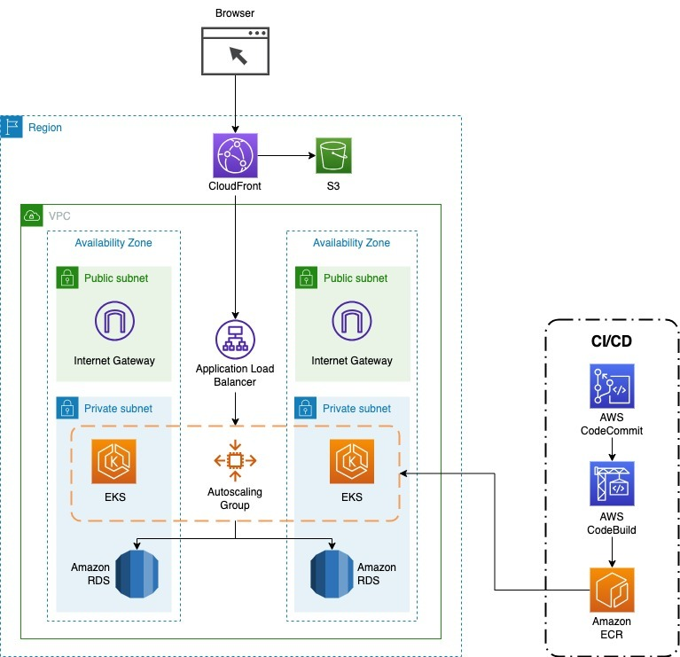

Para a utilização dessa solução, é indispensável uma plataforma auxiliar que servirá para definir os métodos de aplicação dos testes. O foco aqui está em centralizar as funcionalidades que o site usará para posteriormente serem testadas com a plataforma principal. Essa aplicação auxiliar fará uso de máquinas EC2 e do banco de dados RDS da AWS. A arquitetura correspondente é apresentada a seguir:

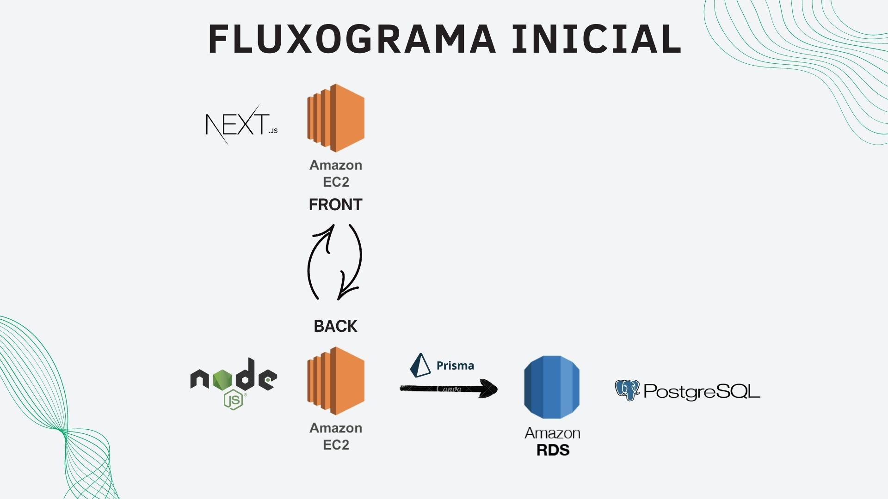

É relevante destacar que aspectos adicionais da solução, tais como Grafana, K6 e GitHub Actions, serão incorporados ao plano de desenvolvimento em etapas futuras. Como o projeto está sob a responsabilidade de alunos de graduação, há ainda áreas a serem investigadas e habilidades técnicas a serem desenvolvidas. Portanto, o planejamento apresentado reflete o conhecimento atual da equipe, com a intenção de integrar esses componentes adicionais nas entregas de sprints subsequentes.

Em suma, o TAPI consegue relatar os parâmetros que o MVP (Minimum Viable Product, do inglês, mínimo produto viável) deverá conter:

> *1. Aplicação implantada em Cluster Kubernetes funcional: Uma versão inicial da aplicação em um cluster Kubernetes deve ser implementada. Esta versão inicial deve ser capaz de suportar uma carga básica de trabalho e mostrar que os componentes principais estão funcionando conforme esperado.*
> *2. Testes de carga básicos com K6: Os alunos devem ser capazes de realizar testes de carga básicos usando a ferramenta K6. Estes testes devem demonstrar que o cluster Kubernetes é capaz de lidar com uma quantidade mínima de tráfego.*
> *3. Configuração básica do GitHub Actions: Os alunos devem implementar uma configuração básica do GitHub Actions que possibilite a execução dos testes de carga do K6 e a verificação do funcionamento do cluster Kubernetes.*
> *4. Análise básica de responsividade e uso de recursos: Através do dashboard Grafana, os alunos devem ser capazes de analisar a responsividade do sistema e o uso dos recursos durante os testes de carga. Esta análise básica deve fornecer informações suficientes para avaliar a viabilidade da solução.*

#### E se?

O TAPI elabora nos benefícios esperados para o parceiro:

> *BENEFÍCIOS ESPERADOS PARA O PARCEIRO: O projeto contribuirá com a formação dos alunos permitindo que eles sintam o tipo de problemas que nosso time de plataformas de tecnologia deve lidar. Além disso, eventuais soluções inovadoras que os alunos utilizem para resolver o problema podem vir a ser incorporadas nos processos da equipe.*

Além dos benefícios derivados das ideias propostas pelos alunos, a entrevista também destacou outros ganhos potenciais para o parceiro:

> **Como a Stone vai se beneficiar com o nosso projeto? (impacto no negócio)**
>
>> *Aprimoramento de códigos, identificação e correção de gargalos, implementação de métricas que detectem pontos de lentidão e fortalecimento da cultura de testes em geral.*
>>

Portanto, é possível inferir que os avanços técnicos estarão focados nos insights gerados pelas visualizações do sistema, possivelmente utilizando o Grafana, e na capacidade inventiva dos alunos para enfrentar o desafio de alcançar 35 mil requisições por segundo.

Como consequência do sucesso do projeto, surgem os benefícios relacionados à resolução do problema de gargalo, permitindo que o site acomode todos os usuários que acessam a plataforma durante as campanhas de marketing. Isso resultará em uma maior conversão de visitantes no funil de clientes estabelecido pela empresa.

### Figuras

Tendo definido os stakeholders como os funcionários da Stone e os clientes que acessam o site, é possível agora elaborar sobre essas pessoas, facilitando a compreensão do contexto no qual a aplicação está inserida.

#### Quem? - Persona

Primeiramente, apresentamos a persona representante de uma **funcionária da Stone**, referida como **Denise**.

Além disso, são fornecidos detalhes adicionais sobre quem essa pessoa é, contribuindo para uma compreensão mais completa.

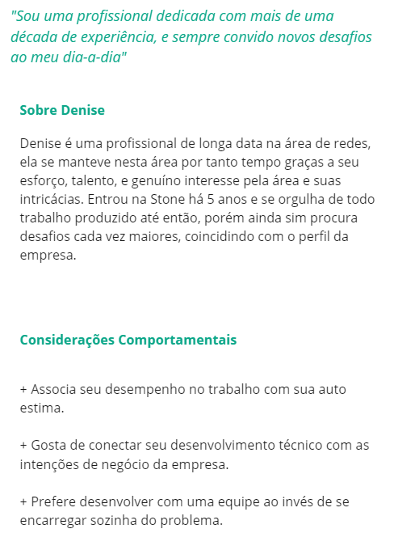

Optou-se por escolher uma desenvolvedora profundamente engajada com as intenções da Stone. Esta decisão reflete a busca por alguém que tenha estudado todos os aspectos da empresa e as possíveis maneiras de ampliar seus benefícios, servindo como uma representante parcial da equipe de desenvolvimento do projeto, assim como os representantes da própria Stone.

Também foi criado a persona representante dos **clientes da Stone**, referido como **Roberto**.

Também foi construído com detalhes adicionais:

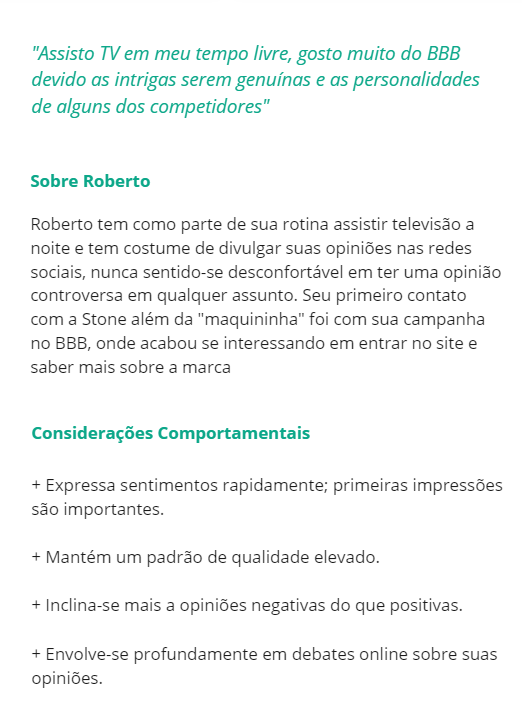

A escolha de Roberto foi baseada no tipo de cliente que traria maiores repercussões ao ser afetado, de acordo com a entrevista com o cliente:

> **A promoção no programa Big Brother atrai um público-alvo específico? Ex. Renda, faixa etária, etc.**
>
>> *O público-alvo é vasto, e os únicos aspectos mensuráveis são fatores quantitativos, como o aumento de credenciamento e outros indicadores similares. Esse crescimento foi observado especificamente na Ton.*
>>

O público-alvo é abrangente e indefinido, logo, é responsabilidade da equipe de desenvolvimento identificar o tipo de cliente mais pertinente. Roberto representa uma combinação de todos os aspectos que a equipe de desenvolvimento considerou significativos para a solução, como sua tendência crítica e inclinação para discursos negativos, bem como a busca por formas de depreciar a imagem daquilo que desaprova.

#### Como? - Figuras

Denise, a persona em questão, é caracterizada como "Ansiosa". Isso ocorre devido à dependência do desenvolvedor nos testes realizados, que por vezes podem ser insuficientes e deixar passar detalhes despercebidos. Dessa forma, sua classificação como "Ansiosa" é resultado da combinação de diversos fatores:

É possível concluir que seus problemas estão principalmente relacionados aos testes e suas execuções, além da performance da página após os testes serem aprovados.

Esses problemas geram um sentimento de ansiedade e insegurança em relação ao produto, bem como destacam a relevância do desafio. Sem acesso adequado, todo o esforço em design, funcionalidade e vendas do site pode ser desvalorizado ou anulado. Quando tudo funciona corretamente, não há um impacto significativo, já que o site simplesmente opera como deveria. Assim, a situação se resume a: se acertar, ninguém dá importância; se errar, todos reclamam.

Já a persona representada por Roberto é categorizada como "Chatão", que é a maneira informal de reconhecer um crítico de pavio-curto, que trará repercussões negativas á empresa nas redes sociais e quaisquer outros veículos de comunicação á sua disposição, definido como:

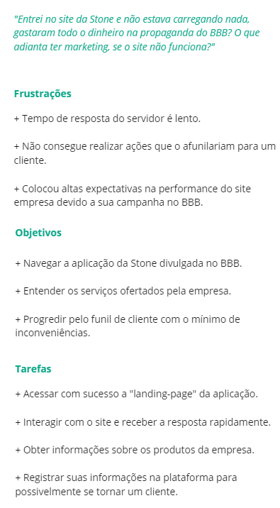

Essa caracterização identifica a persona como o "Chatão", simbolizando o tipo de cliente difícil de satisfazer. Conseguir uma opinião neutra dele pode ser interpretado como um sucesso na aplicação. A natureza desse perfil não necessita de uma exploração profunda, pois é uma definição intrínseca, não baseada em eventos específicos. A relevância desse perfil no contexto em questão se manifesta na sua baixa tolerância a falhas, impondo um nível mais rigoroso de qualidade.

Essas são as figuras identificadas; as emoções associadas foram consideradas mais relevantes para o caso específico devido aos seus impactos na aplicação. Desenvolvedores ansiosos e clientes difíceis de agradar ("chatões") indicam ambientes não otimizados e revelam fragilidades que podem ser áreas de foco. A ansiedade do desenvolvedor pode ser aliviada com o uso de plataformas de visualização e testes mais sólidos, enquanto clientes difíceis de agradar podem ser mitigados ao garantir que a experiência do usuário seja rápida, eficiente e agradável. Esses aspectos são cruciais para formar o contexto da aplicação.

### História

A história combina todas as ideias, conteúdos e personagens em um contexto de uso, descrevendo como e por que os usuários utilizarão a solução. Também define o plano de entrega, detalhando como essa solução será comunicada aos usuários.

#### Estrutura

O projeto visa resolver o problema da incapacidade de atender a todos os usuários atraídos pelo marketing, o que resulta em perda financeira. Se o site não consegue converter o cliente porque ele não consegue interagir com a plataforma, é uma situação até pior do que se o cliente simplesmente não tivesse interesse.

A estrutura proposta envolve um cenário em que ocorre uma campanha de marketing da Stone, e o site deve ter a capacidade de acomodar todos os clientes impactados por essa campanha.

#### Personagens

As personas Denise e Roberto são os personagens centrais. Denise simboliza a empatia na história, buscando oferecer uma plataforma escalável e confortável para todos os clientes. Roberto age como antagonista, criticando a plataforma e tentando descontentar Denise com o trabalho realizado, tomando suas próprias experiências como referência e fazendo com que tudo gire em torno dele.

Logo, os personagens são as personas representando suas figuras.

#### Senso de Urgência

A campanha, tendo um tempo limitado para interação e incentivando os clientes a usar a plataforma em momentos específicos, cria uma situação difícil de controlar. A falta de controle total e a imprevisibilidade dos servidores podem levar a problemas, como ultrapassar 35 mil requisições por segundo ou sobrecarregar a API de um cliente, mesmo com testes em vigor.

Se algo der errado, não haverá muito tempo para reagir, e a confiança deve residir no planejamento prévio. Como não há muito a ser feito em caso de falha, a sensação de inquietação se demonstra presente.

Portanto, o senso de urgência é derivado da necessidade de planejamento prévio, pois sem ele, não será possível remediar a situação através de uma resposta rápida.

#### Plano de Entrega

É importante entender o significado de colocar um anúncio em um show de grande audiência como o BBB. Isso pode gerar muito engajamento e audiência, destacando a seriedade da situação e o grande investimento em tempo e dinheiro.

Em seguida, apresentaremos a personagem Denise, que recebeu a responsabilidade de escalar os sistemas em preparação para a campanha. Vamos destacar como ela está animada com essa tarefa e percebe que isso representa uma grande oportunidade para a empresa. Posicionando, consequentemente, como a personagem principal e a que as audiências deverão torcer por ela.

A seguir, apresentaremos os primeiros desafios: a ausência de uma plataforma de testes unificada e genérica para realizar diversos testes de carga, a falta de métodos práticos para visualizar tudo de forma eficiente como no k6, e os custos de hospedagem que continuam aumentando. Isso ilustrará que Denise enfrenta muito mais trabalho do que inicialmente imaginava.

Avançamos então para a próxima etapa, na qual Denise executa os códigos e realiza os testes, acreditando que está tudo em ordem. No entanto, ela ainda é atormentada pela incerteza, questionando-se se rodou todas as verificações necessárias, se havia algo mais a ser feito e se tudo vai funcionar conforme planejado. A ansiedade começa a surgir.

O teste não alcançou 35 mil, mas estava próximo, e isso causou problemas. Muitas pessoas, incluindo Roberto, não conseguiram acessar. Roberto começou a criticar a Stone no Twitter, atraindo atenção. Algumas pessoas discordaram dele, mas outras ouviram suas queixas e se uniram a ele em sua crítica.

O desfecho da história ocorre com o fim da campanha, deixando várias reclamações no Twitter. Denise enfrenta o desafio de repetir todo o processo de testes, pois não existe uma plataforma padrão para uso genérico. A falta de insights para identificar o que deu errado torna a tarefa ainda mais demorada e complicada, e assim a história chega ao seu fim.

A narrativa enfatiza o desafio de um armazenamento em nuvem que não responde rapidamente às variações de demanda, levando à insatisfação de clientes que deixam o site após uma experiência negativa. A dificuldade em identificar e corrigir erros agrava o problema. A solução proposta visa enfrentar essa questão, facilitando a identificação e correção de problemas de carga, fornecendo as ferramentas necessárias para uma gestão eficaz.

## Pesquisa Qualiquantitativa

Após uma análise preliminar aprofundada, pode-se constatar que existem informações sólidas e adequadas para conduzir uma pesquisa qualiquantitativa. Nela, serão avaliados, através de perguntas objetivas e quantificáveis, insights e compreensões que não foram alcançados com os métodos utilizados anteriormente.

Os dados coletados são não-probabilisticos, isto é, não refletem interamente os usuários que acessam o site ou utilizam os produtos Stone, somente uma pequena amostra que visa tracejar um público-alvo como base para o projeto.

O formulário obteve no total 15 (quinze) respostas, com todos os entrevistados sendo do estado de São Paulo.

### Primeira parte: Dados sociais

Os dados coletados nessa primeira parte são um reflexo das características sociais dos entrevistados. Somente Idade, Bairro de Residência e Profissão foram coletados pois são os únicos dados de relevância para o projeto se comparados a coisas como Nome e Sexo.

#### Idade

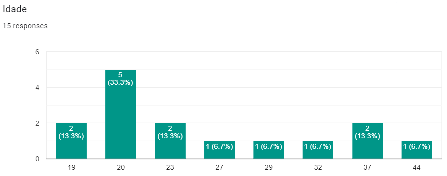

A idade dos entrevistados abrange de 19 a 44 anos. Há um pico maior na faixa etária de adultos jovens (20 a 24 anos) resultando em quase 50% dos entrevistados.

#### Bairo de Residência

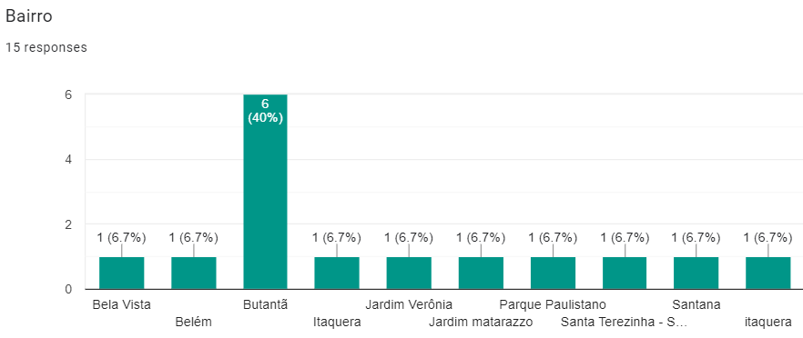

Sobre o Bairro de Residência, é visível que a maioria reside na São Paulo capital, com apenas 1 (uma) resposta sendo de São Bernado do Campo (Santa Terezinha).

#### Profissão

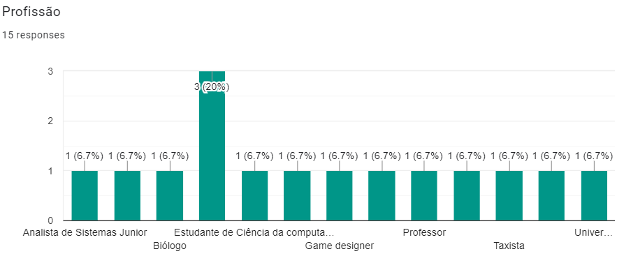

A profissão dos entrevistados, a primeira vista, não aparenta um dado relevante ao projeto. Porém, caso uma segunda visita ao gráfico seja feita, é visível uma variedade de profissões que abragem desde Estudantes e Professores até Atendentes (não visível no gráfico) e Taxistas.

Levando em consideração os dados coletados, pode-se chegar a uma conclusão que a Stone Pagamentos possui um foco mais universal no seu público alvo, não sendo fácil encontrar uma "Persona Universal" que abrangesse todos os entrevistados.

### Segunda parte: Problemas com o site

Nesta segunda parte, houve um foco em saber se algum dos entrevistados encontrou algum problema ao visitar o site da Stone Pagamentos.

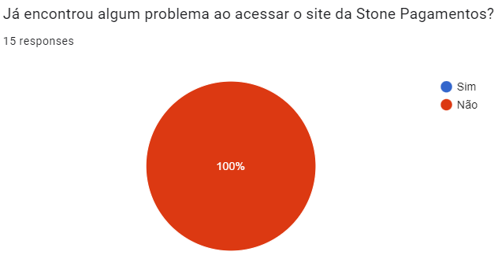

Este gráfico revela um ponto positivo e negativo: o positivo demonstra que a acessibilidade e disponibilidade do serviço web da Stone Pagamentos raramente apresenta falhas e problemas no acesso, pois nenhum entrevistados encontraram tais ocorridos.

O ponto negativo, no entanto, seria que não foi possível coletar dados cruciais daqueles que enfrentaram dificuldades no acesso. Mesmo não sendo comum, caso um erro aconteça, saber dados como a página com mais frequência de erros e quanto tempo o sistema demorou para responder poderiam ser utilizados para consertar pontos fracos do sistema.

Perguntas sobre essa etapa serão infelizmente desconsideradas, pois não obtiveram respostas por ninguém presenciar um erro no site. As perguntas foram:

- Quantas vezes já aconteceu?
- Há quanto tempo houve o último ocorrido?
- Descreva brevemente o caso mais recente.
- O problema persistiu mesmo após você tentar solucioná-lo?
- De uma escala de 1 a 5, o quão frustrante foi a experiência?

### Terceira parte: Satisfação com o site e serviços web em geral

Na terceira (e última parte) busca-se saber dos entrevistas suas opiniões e avaliações sobre o site Stone Pagamentos e quais são suas preferências sobre serviços web em geral.

#### Nota sobre aparência do site

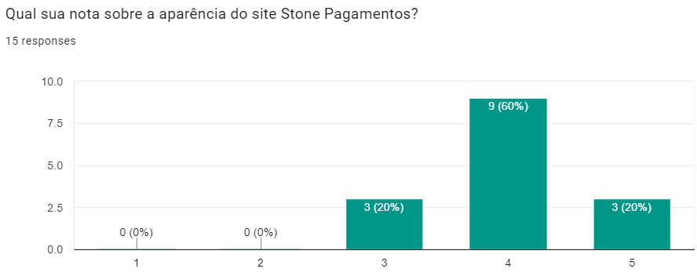

Sobre a aparência do site, a maioria dos entrevistados avaliaram notas positivas (4-5), com a soma resultando 80% do total. Uma parcela de 20% se mostraram neutros com nota 3, mas ninguém respondeu notas negativas como 1 e 2, o que poderia ser visto ao mesmo tempo como algo positivo, pois não há reclamações, como algo negativo, pois não exibe como um todo a avaliação real das pessoas que acessam o site.

#### Nota sobre simplicidade do site

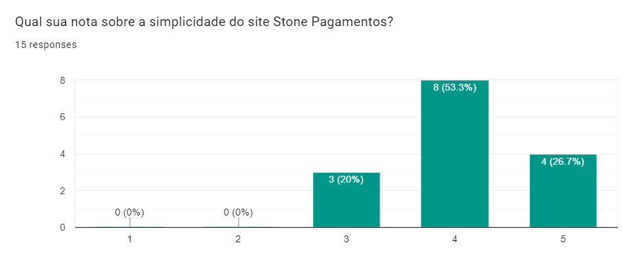

Sobre a simplicidade do site, as notas são quase identicas as apresentadas na seção anterior, com uma pequena diferença de menos uma avaliação 4 e mais uma avaliação 5, mostrando que, mesmo sendo uma pequena diferença, o site possui maior simplicidade do que elegância em design de acordo com os entrevistados.

#### Preferências sobre retorno a um site em caso de falhas

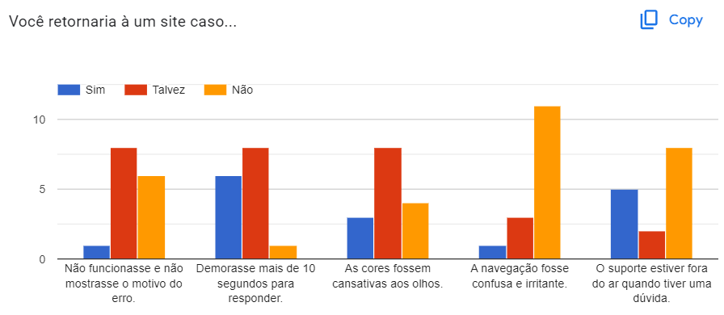

Ao analisar os gráficos, informações preciosas são coletadas e pode-se aprender muito sobre os entrevistados.

Um detalhamento de cada caso será apresentado seguindo o padrão de listas e uma conclusão no final:

- "Não funcionasse e não mostrasse o motivo do erro":
   - Somente 1 (uma) resposta "Sim".
   - 8 (oito) respostas "Talvez".
   - 6 (seis) respostas "Não".
  
  
Pela distribuição de respostas, torna-se aparente que esta falha é pouco tolerada pelos entrevistados, pois caso dividissemos metade das escolhas de "Talvez" para "Sim" e "Não, obteriamos uma distribuição 5:10 (cinco para dez) entre "Sim" e "Não, respectivamente, onde 2/3 (dois terços) dos entrevistados não retornariam ao site, resultando numa perda significativa de possíveis clientes.

- "Demorasse mais de 10 segundos para responder":
   - 6 (seis) respostas "Sim".
   - 8 (oito) respostas "Talvez".
   - Somente 1 (uma) resposta "Não".

Entre os erros respondidos na pesquisa, este seria o mais aceitável, com certas semelhanças com o gráfico anterior, onde "Sim" e "Não" estão trocados. E caso metade dos "Talvez" fosse para cada lado, ficaria uma distribuição de 10:5 (dez para cinco) entre "Sim" e "Não", respectivamente, onde 2/3 (dois terços) dos entrevistados retornariam ao site.

- "As cores fossem cansativas aos olhos":
   - 3 (três) respostas "Sim".
   - 8 (oito) respostas "Talvez".
   - 4 (quatro) respostas "Não".

O gráfico mais equilibrado dentre todos. Caso as pessoas entre "Talvez" se dividissem entre "Sim" e "Não, respectivamente, obteriamos uma distribuição próxima de 1:1 (um por um) entre pessoas em "Sim" e "Não", com o último possuindo um voto amais.

- "A navegação fosse confusa e irritante":
    - Somente 1 (uma) resposta "Sim".
    - 3 (três) respostas "Talvez".
    - 11 (onze) respostas "Não".

A falha que mais aborrece e, ao mesmo tempo, a mais difícil de ser consertada, pois é necessário sincronia entre os times de UX e Integração Web. Aproximadamente 73% dos entrevistados não voltariam ao site, sem sequer considerarmos a dividir as pessoas que escolheram "Talvez", como nas perguntas anteriores. Errar neste ponto seria devastador para qualquer site, e a pesquisa, mesmo pequena, mostra isto.

- "O suporte estiver fora do ar quando tiver uma dúvida":
  - 5 (cinco) respostas "Sim".
  - Somente 2 (duas) respostas"Talvez".
  - 8 (oito) respostas "Não".

Sem dúvidas a pergunta que os entrevistados estavam mais decididos sobre suas escolhas. Dividindo as pessoas em "Talvez" como anteriormente, obteriamos uma porcentagem de 40% "Sim" e 60% "Não". Mesmo a taxa de rejeição a essa falha sendo relativamente alta, não está entre as duas maiores apresentadas.

#### Sumarização sobre a Terceira Parte

Podemos concluir que a ordem de rejeição dos entrevistados sobre possíveis falhas em serviços (com votos em "Talvez" dividos igualmente na medida do possível entre os dois lados) seria:

1. "A navegação fosse confusa e irritante": 80% à ~87%
2. "Não funcionasse e não mostrasse o motivo do erro": ~67%
3. "O suporte estiver fora do ar quando tiver uma dúvida": 60%
4. "As cores fossem cansativas aos olhos": ~53%
5. "Demorasse mais de 10 segundos para responder": ~33%

Com os dados dispostos de tal forma, se torna fácil saber quais falhas devem ser evitadas a todo custo e causam maiores danos a empresa, quais são mais toleráveis pelos usuários e em qual ordem os recursos de conserto do site poderiam ser sistematicamente distribuídos.

### Quarta parte: Conclusão

Depois da análise completa da Pesquisa Qualiquantitativa e as informações que ela tem à apresentar em conjunto de suas limitações, pode-se tirar inúmeras informações importantes, como um rascunho de possíveis publicos-alvos sendo jovens adultos (seção Idade) para a Stone Pagamentos, suas avaliações individuais sobre o funcionamento do site que demonstram satisfação sobre o estado atual do serviço web com certo equilíbrio entre Aparência e Simplicidade, quais são suas opiniões sobre problemas relacionados a serviços web, onde os dados mostram que a maioria dos problemas apresentados possuem taxas de rejeição acima de 50%, o que resultaria numa perca imensa de possíveis clientes e traria um viés negativo a empresa. Porém, por nenhum entrevistado ter encontrado problemas ao acessar o site, pode-se supor que a infraestrutura se encontra com funcionamento satisfatório aos usuários.

Por fim, a pesquisa aponta que mesmo a Stone Pagamentos não enfrente problemas corriqueiros de infraestrutura, qualquer falha pode causar frustração a clientela e reprimir possíveis contratadores de serviço. Se levarmos em consideração sobre a existência do projeto ser baseado em uma infraestrutura capaz de suportar sobrecarga de acessos, torna-se evidente que não há a necessidade da formulação e aplicação de uma infraestrutura capaz de suportar uma carga média de usuários onde não a necessidade de escalabilidade em momentos de pico, mas sim uma que possa aguentar sobrecarga e causar a menor quantidade de problemas possíveis aos usuários, levando sempre em cuidado quais são os problemas mais irritantes como "Não funcionasse e não mostrasse o motivo do erro" e mais toleráveis, como "Demorasse mais de 10 segundos para responder". Mesmo que os entrevistados tenham encontrado nenhum problema durante o acesso, é incerto se a satisfação dos usuários seria a mesma caso o site apresentasse falhas em momentos cruciais de acesso.
