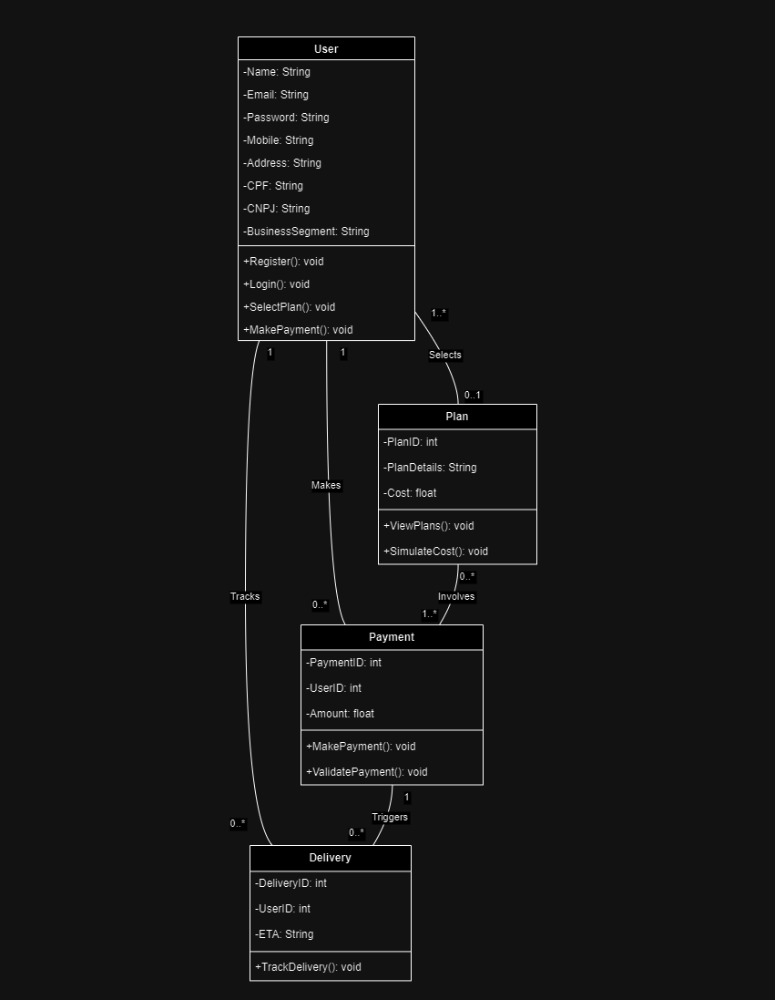

# Diagrama de Sequência

Um Diagrama de Sequência é uma representação visual que descreve a interação entre objetos em um sistema ao longo do tempo. Ele mostra como os objetos trocam mensagens e colaboram em uma ordem sequencial, ajudando a entender o comportamento dinâmico do sistema.
  

 O usuário (User) tem funções para registrar e fazer login em sua conta. O usuário consegue verificar os planos disponíveis para sua conta e recebe os planos como retorno, interagindo com o Plano (Plan), que possui o preço e quais são os planos e suas descrições. Também existe a possibilidade de simular os custos e selecionar um plano. Uma vez feito o pagamento, o Pagamento (Payment) procura os detalhes desse plano selecionado na classe Plano (Plan), podendo então ser validado o pagamento e retornando ao usuário que o pagamento foi realizado. O usuário então pode visualizar como está a entrega do produto pelo Delivery, que retorna o tempo estimado para a chegada.

# Diagrama de Classes

Um Diagrama de Classes é uma representação gráfica que exibe as classes em um sistema de software e suas relações. Ele mostra a estrutura estática do sistema, destacando as classes, seus atributos e métodos, bem como as associações entre elas.

  O usuário (User) tem funções de criar e entrar na conta, além de selecionar e fazer o pagamento de um plano. O Plano (Plan) tem atributos detalhando cada plano e funções que possibilitam a visualização desses detalhes. O Pagamento (Payment) faz e valida o pagamento de um usuário por um plano. O Delivery mostra o tempo estimado para a chegada de um produto dado um pagamento de um usuário por um plano. O relacionamento entre o usuário (User) e o Plano (Plan) é que um usuário pode ter ou não um plano, enquanto um plano pode ter um ou mais usuários. Já o relacionamento entre User-Payment e User-Delivery é de um para muitos. Um plano pode ter um ou mais pagamentos, e um pagamento pode envolver nenhum ou mais planos. Um pagamento pode iniciar várias entregas, e uma entrega só pode ser iniciada por um pedido.

 # Diagrama de Implantação 

Um Diagrama de Implantação é uma representação visual que descreve como os componentes de um sistema de software são implantados em hardware ou ambientes de execução. Ele mostra como os diferentes componentes, como servidores, aplicativos e bancos de dados, estão distribuídos e interconectados fisicamente em uma infraestrutura de implantação. Esse tipo de diagrama é útil para planejar a implantação real de um sistema em servidores físicos ou em nuvem, permitindo uma visão geral da arquitetura de implantação.

 

 O computador do usuário, utilizando um navegador, consegue acessar o balanceador de carga (load balancer) do frontend, que faz a distribuição de usuários entre as máquinas do frontend. Essas máquinas utilizam o CloudFront para receber as imagens que precisam para colocar nas páginas da aplicação. A máquina do frontend então faz uma requisição HTTP para o balanceador de carga (load balancer) do backend, que distribui entre as máquinas do backend o fluxo de requisições. Essa máquina do backend se conecta ao banco de dados por TCP e retorna as informações necessárias para o frontend e o usuário. Já no fluxo do desenvolvedor, utilizando o PowerShell, o desenvolvedor acessa o Bastion Host, que irá disponibilizar acesso às máquinas tanto do frontend quanto do backend.

# Diagrama de Casos de Uso

Esse diagrama documenta o que o sistema faz do ponto de vista do usuário. Em outras palavras, ele descreve as principais funcionalidades do sistema e a interação dessas funcionalidades com os usuários do mesmo sistema. Nesse diagrama não nos aprofundamos em detalhes técnicos que dizem como o sistema faz.

 

 ## Sistema de Registro

### Escopo:
Sistema de gerenciamento de contas de usuários.

### Nível:
Nível do sistema.

### Ator:
Usuário.

### Interessados e Interesses:
Usuário: Deseja criar uma conta.

### Pré-Condições:
O sistema está em funcionamento.

### Pós-Condições:
O usuário pode acessar sua conta.

### Fluxo Básico:
Registro de Usuário:
O usuário inicia o processo de registro.
O sistema coleta informações de registro.
O sistema cria uma conta de usuário.

Login de Usuário:
O usuário realiza o login.
O sistema verifica as credenciais.
O usuário acessa sua conta.

### Fluxos Alternativos:
Registro de Usuário: Se o usuário já estiver registrado, ele pode optar por fazer login em vez de se registrar.

Login de Usuário: Se as credenciais forem inválidas, o usuário recebe uma mensagem de erro.

### Requisitos Especiais:
Sistema ser capaz de validar o usuário.

### Frequência de Ocorrência:
O registro e login de usuários são ações frequentes.

## Seleção de Planos

### Escopo:
Seleção de planos.

### Nível
Nível do sistema.

### Atores:
Usuário e Plano.

### Interessados e Interesses:
Usuário: Deseja selecionar planos.
Plano: Fornece informações sobre os planos disponíveis.

### Pré-Condições:
O sistema está em funcionamento.

O usuário está registrado ou realiza o registro.

Planos estão disponíveis.

### Pós-Condições:
O usuário pode selecionar um plano.

### Fluxo Básico:
O usuário navega pelos planos disponíveis.

O usuário seleciona um plano.

### Fluxos Alternativos:
O usuário pode cancelar a seleção do plano a qualquer momento.

### Lista de Variantes:
Os planos oferecidos podem variar em termos de recursos e preços.

### Frequência de Ocorrência:
A seleção de planos ocorre quando o usuário decide adquirir um plano.

## Pagamento

### Escopo: 
Processamento de pagamentos

### Nível: 
Nível do sistema.

### Atores:
Usuário e Pagamento

### Interessados e Interesses:
Usuário: Deseja criar uma conta, selecionar planos, fazer pagamentos e rastrear entregas.
Pagamento: Processa pagamentos dos usuários.

### Pré-condições:
O sistema está em funcionamento.
O usuário está registrado ou realiza o registro.
Pagamentos podem ser processados.

### Pós-condições:
O pagamento é registrado e validado.

### Fluxo Básico:
O usuário inicia o processo de pagamento.

O sistema coleta informações de pagamento.

O pagamento é processado e validado.

O sistema registra o pagamento.

### Fluxos Alternativos:
Se o pagamento não for aprovado, o usuário receberá uma notificação de erro.

### Requisitos Especiais:
O sistema deve ser capaz de processar pagamentos de forma segura.

### Lista de Variantes:
Diferentes métodos de pagamento podem ser suportados.

### Frequência de Ocorrência:
O pagamento ocorre quando o usuário decide adquirir um plano.

### Problemas em Aberto:
A segurança dos pagamentos online deve ser uma preocupação contínua.

## Rastreamento de Entrega

### Escopo: 
Rastreamento de entrega.

### Nível: 
Nível do sistema.

### Atores:
Usuário e Delivery

### Interessados e Interesses:
Usuário: Deseja rastrear entregas.
Delivery: Fornece informações de rastreamento de entrega.

### Pré-condições:
O sistema está em funcionamento.

O usuário está registrado ou realiza o registro.

Entregas podem ser rastreadas.

### Pós-condições:
O usuário pode rastrear a entrega.

### Fluxo Básico:
Rastreamento de Entrega:

O usuário verifica o status da entrega.

O sistema fornece o tempo estimado para a chegada.

### Fluxo Alternativo:
Se não houver entregas associadas à conta do usuário, o sistema informará que não há entregas para rastrear.

### Requisitos Especiais:
As informações de entrega devem ser atualizadas em tempo real.

### Frequência de Ocorrência:
O rastreamento de entrega é realizado ocasionalmente pelos usuários.

### Problemas em Aberto:
A precisão das informações de entrega deve ser mantida.
