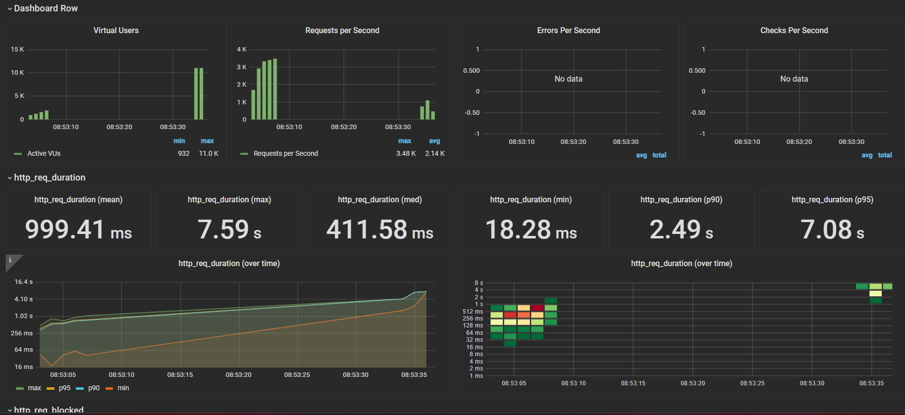

# Introdução

O propósito deste relatório é validar um dos principais critérios do projeto: a capacidade de carga da aplicação, que se refere a um de nossos requisitos não funcionais.

Iniciaremos apresentando todos os requisitos funcionais do projeto. Após essa contextualização, focaremos no teste de carga e exibiremos os resultados obtidos.

Vale ressaltar que este documento não aborda comportamentos da interface em situações de falhas decorrentes dos testes, devido a ausência desses recursos.

# Requisitos Não Funcionais

Em nosso projeto, contemplamos 6 (seis) requisitos não funcionais, sendo eles:

- RNF1: Velocidade da aplicação em casos comuns
- RNF2: Velocidade da aplicação em picos de tráfego
- RNF3: Picos de acesso
- RNF4: Elasticidade
- RNF5: Intuitividade
- RNF6: Segurança de dados

Utilizando dos testes de carga, conseguimos verificar a **velocidade da aplicação em casos comuns e em picos de tráfego, picos de acesso, e a elasticidade**.

Quanto a **intuitividade e a segurança de dados**, estes requisitos foram testados e documentados como parte dos testes do sistema (testes_sistema.md), logo, não serão contemplados neste trabalho.

# Testes de Carga

Nesta seção, abordaremos todo o procedimento dos testes de carga, desde a concepção até a execução.

## Ferramentas utilizadas

### K6

Para a execução dos testes, foi utilizada o framework **K6,** da empresa GrafanaLabs.

Segundo a [documentação Oficial K6](https://k6.io/docs/#:~:text=Grafana%20k6%20is%20an%20open,performance%20regressions%20and%20problems%20earlier.), "*Grafana k6 é uma ferramenta de teste de carga de código aberto que torna os testes de desempenho fáceis e produtivos para equipes de engenharia. k6 é gratuito, centrado no desenvolvedor e extensível.*

*Usando o k6, você pode testar a confiabilidade e o desempenho de seus sistemas e detectar regressões e problemas de desempenho mais cedo. k6 ajudará você a criar aplicativos resilientes e de alto desempenho escaláveis.*"

Para atingir nosso objetivo de testar a carga da nossa plataforma, o K6 se apresenta como a ferramenta ideal devido à sua adaptabilidade em lidar com diferentes cenários. Essa ferramenta permite realizar testes com diversas magnitudes de carga, enviadas em variáveis intervalos de tempo, tudo isso sendo completamente gerenciado pelo usuário por meio de um script de teste desenvolvido em JavaScript.

### Grafana

Também desenvolvido pela empresa GrafanaLabs, o **Grafana** é a ferramenta que utilizamos para interpretar os dados gerados pelo K6.

Segundo a [documentação Oficial Grafana](https://grafana.com/docs/grafana/latest/introduction/), "*O software de código aberto Grafana permite consultar, visualizar, alertar e explorar suas métricas, logs e rastreamentos onde quer que estejam armazenados*"

Os resultados gerados pelos testes com o K6 não são de fácil compreensão, especialmente para iniciantes. Portanto, o Grafana é uma ferramenta valiosa que nos ajuda a visualizar esses dados de forma clara, proporcionando gráficos e consolidações que simplificam nossa análise.

Em nossa situação específica, optamos por um modelo de gráficos que demanda o **InfluxDB**, um banco de dados especializado em séries temporais. Além de ser uma exigência do template, um grande benefício de escolher o InfluxDB como fonte para nosso painel no Grafana é que o K6 possui suporte nativo para ele como saída, agilizando e simplifcando o processo de integração entre o K6 e o Grafana.

### Amazon EC2

Já abordamos este serviço extensivamente em outras seções deste projeto, por isso, manteremos a introdução breve: a Amazon EC2 é o serviço de computação em nuvem da Amazon, proporcionando uma máquina virtual na nuvem para variadas finalidades.

Neste projeto utilizamos a EC2 para executar o K6 e o Grafana, visto que nosso teste envolve 35.000 requisições, é possível inferir que este processo irá exigir altos recursos computacionais, impossibilitando sua execução em uma máquina local física. Logo, optamos por transferir essa demanda para a nuvem, onde uma máquina robusta possa lidar com a carga, e após estudos sobre qual seria a máquina ideal, selecionamos a **z1d.large** devido a seu alto desempenho.

## Planos de Teste

Os testes devem ser voltados para suprir as necessidades inseridas nos requisitos não funcionais, logo, estruturamos o planejamento desses testes da seguinte forma:

### Teste 01: Teste em casos comuns

Relacionado ao requisito não funcional "**RNF1: Velocidade da aplicação em situações comuns**", este teste deve simular uma carga típica, e a aplicação precisa assegurar que o carregamento da página ocorra em, no máximo, 2 segundos.

O teste foi criado considerando que "carga normal" define-se como **600 requisições/segundo** (baseado em [um artigo sobre a capacidade de escalabilidade do Twitter](http://highscalability.com/blog/2009/6/27/scaling-twitter-making-twitter-10000-percent-faster.html)), e uma variação de 20% para representar a flutuação de usuários na plataforma.

Como mencionado anteriormente, o K6 utiliza Javascript. A seção do código responsável pelo planejamento dos testes é definida pela variável **options**. Para este teste específico, ela é configurada da seguinte maneira:

```javascript
export const options = {
  scenarios: {
    variable_request_rate: {
      executor: 'ramping-arrival-rate',
      startRate: 600,
      timeUnit: '1s',
      preAllocatedVUs: 100, 
      maxVUs: 1000,
      stages: [
        { duration: '10s', target: 660 }, 
        { duration: '10s', target: 540 }, 
        { duration: '10s', target: 600 }, 
	{ duration: '10s', target: 480 }, 
	{ duration: '10s', target: 720 }, 
        { duration: '10s', target: 600 }, 
      ],
    },
  },
};
```

### Teste 02: Teste em picos de tráfego

Relacionado aos requisitos não funcionais "**RNF2: Velocidade da aplicação em picos de tráfego**" e "**RNF3: Picos de acesso**", este teste deve simular uma carga típica, e a aplicação precisa assegurar que o carregamento da página ocorra em, no máximo, 2 segundos.

Como já definimos nossa carga comum no teste anterior, este teste será um incremento em cima deste caso; primeiro, a carga típica de 600 usuários por segundos, seguida por um brusco pico de usuários chegando até a **35.000 requisições/segundo**.

A variável options do teste é definida como:

```javascript
export const options = {
  scenarios: {
    variable_request_rate: {
      executor: 'ramping-arrival-rate',
      startRate: 600,
      timeUnit: '1s',
      preAllocatedVUs: 100, 
      maxVUs: 40000,
      stages: [
        { duration: '5s', target: 660 }, 
        { duration: '45s', target: 35000 }, 
        { duration: '10s', target: 600 }, 
      ],
    },
  },
};
```

### Teste 03: Teste de Elasticidade

Relacionado ao requisito não funcionail "**RNF4: Elasticidade**" e "**RNF3: Picos de acesso**", este teste não tem um objetivo de requisições fixo, seu objetivo é testar e evidenciar as diferenças entre uma aplicação não elástica, e uma elástica, utilizando dos serviços disponíveis da AWS.

O funcionamento do teste é simples; a taxa de crescimento das requisições cresce linearmente de 0 até 35000 requisições por segundo.

A variável options é configurada como:

```javascript
export const options = {
  scenarios: {
    constant_request_rate: {
      executor: 'constant-arrival-rate',
      rate: 35000,
      timeUnit: '1s', 
      duration: '30s',
      preAllocatedVUs: 100,
      maxVUs: 35000,
    },
  },
};
```

## Resultados

### Explicação das métricas K6

O K6 gera um relatório detalhado dos testes. Antes de examinarmos os resultados, é crucial compreender o significado de cada métrica apresentada.

1. **data_received** : Quantidade total de dados recebidos dos servidores alvo durante o teste.
2. **data_sent** : Quantidade total de dados enviados aos servidores alvo durante o teste.
3. **dropped_iterations**: Quantidade total de iterações que não puderam ser inicializadas.
4. **http_req_blocked** : Tempo que as solicitações passaram bloqueadas antes de iniciar a conexão real.
5. **http_req_connecting** : Tempo que as solicitações passaram conectando ao servidor.
6. **http_req_duration** : Duração total de cada solicitação, desde o início até o recebimento da resposta.
7. **http_req_failed** : Percentual e contagem de solicitações que falharam (não receberam uma resposta bem-sucedida).
8. **http_req_receiving** : Tempo gasto recebendo a resposta do servidor.
9. **http_req_sending** : Tempo gasto enviando a solicitação ao servidor.
10. **http_req_tls_handshaking** : Tempo gasto no handshake TLS (para HTTPS).
11. **http_req_waiting** : Tempo entre o final do envio da solicitação e o início do recebimento da resposta.
12. **http_reqs** : Número total de solicitações feitas e a taxa de solicitações por segundo.
13. **iteration_duration** : Duração total de cada iteração (cada execução da função `default`).
14. **iterations** : Quantidade total de iterações concluídas e a taxa por segundo.
15. **vus** : Número atual de Virtual Users (VUs) ativos durante o teste.
16. **vus_max** : Número máximo permitido de VUs para este teste.

### Teste 01

**Resultados K6:**


**Visualização Grafana:**


Pelo gráfico de requisições por segundo e a duração média de requisições (3.26ms), podemos confirmar que conseguimos suprir a necessidade de carga e a velocidade de resposta.

Como foi demonstrado nos gráficos também, não houveram erros durante o teste.

### Teste 02

**Resultados K6**


**Visualização Grafana**


A instabilidade dos dados nos graficos é decorrente da limitação do InfluxDB receber dados do K6, o erro "Request Entity Too Large" aparece frequentemente, e é a causa de por que os dados se mostram tão dispersos e por que há espaços entre uma visualização e outra.

Porém, dado as informações obtidas, é possível afirmar que a aplicação não aguentaria funcionar por muito tempo com esta carga, devido ao grande valor de requests presentes no "**dropped_iterations**".

### Teste 03

Este teste possui uma particularidade: será executado em duas configurações distintas - uma instância EC2 isolada e um ELB com várias instâncias dessa EC2.

#### EC2 Isolada

**Resultados K6**


**Visualização Grafana**


#### ELB

**Resultados K6**


**Visualização Grafana**




Com ambos estes resultados e mesmo com a visualização incompleta dos dados utilizando o ELB, é possível afirmar que este consegue lidar muito melhor com a intensidade de carga, visto que não houve desconexão (timeout no terminal da EC2 Isolada) e a quantidade de **dropped_iterations** também é menor, e a duração média de um request é de 411.58ms, comparado aos 3.62s da EC2 isolada.


## Conclusão


Não foi possível fazer com que a aplicação suportasse 35.000 requests simultâneas por segundo, como era o objetivo do projeto, porém, foi possível validar os esforços quanto a utilização de Load Balancer e confirmar que foram eficientes, e que a aplicação desenvolvida consegue suprir uma carga de trabalho rivalizando a do Twitter com eficiência.
